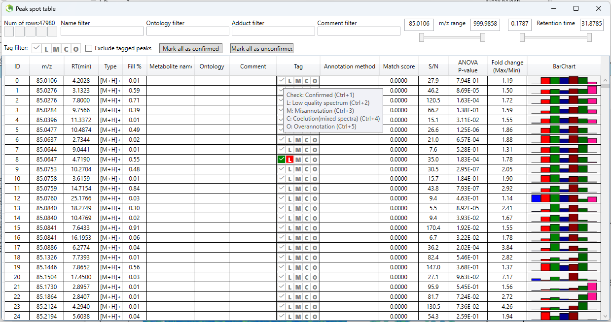
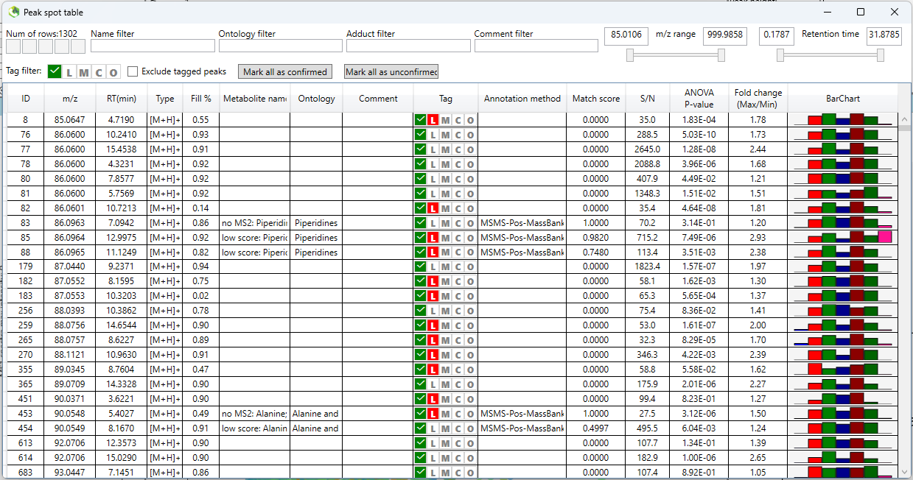
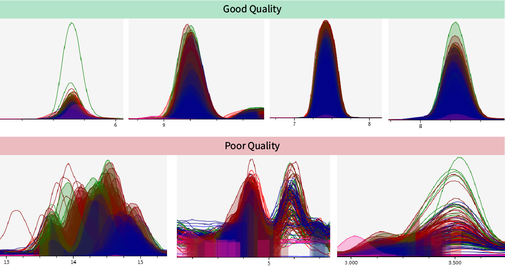

# Manual curation of peaks

Manual peak curation is an essential part of the preprocessing of LMCS datasets, particularly for ensuring that only high quality spectra are retained for downstream analysis and interpretation. Automated tools like `pmp` are a great start, and remove a lot of the noise (which is a big help in reducing the number of peaks we actually have to check), but they are not foolproof and many poor quality peaks will inevitably remain. Manual curation is therefore critical, and both refines the dataset and strengthens confidence in metabolite and lipid identification, which in turn supports more robust biological conclusions.

!!! info "Cutting through the clutter..."

    You will tend to find that about **30-50% of peaks are poor quality** and require removal &ndash; this is of course dataset dependent.

    * Poor signal-to-noise ratio is a common issue, resulting in "messy" and noisy spectra.
    * Peaks only present in a few samples should also be removed to avoid over-fitted data imputation &ndash; it is fine to keep peaks that show up in just a single biological sample group however, because perhaps it is only abundant in this setting.

## Prepare XML files for MS-DIAL 📄🛠️

To speed up the process, we can add a `1` tag to each of the remaining annotated features in our `SummarizedExperiment` object. In MS-DIAL, a `1` tag simply refers to a confirmed metabolite, but for our purposes, we simply need a way to filter the tens of thousands of peaks down to just the ones we need to check.

MS-DIAL actually creates a file already, and so we can just update the two `.xml` files for the positive and negative ionisation modes.

!!! question "Where are these files?"

    These files are located in the main MS-DIAL project folder where you processed the raw LCMS data.

    If you followed the recommendation to choose a custom project name in MS-DIAL, then this will be a lot easier :wink:

    * For example, if your named your project files:
        * `metab_stool_pos.mdproject`
        * `metab_stool_neg.mdproject`
    * Then these files will be:
        * `metab_stool_pos_tags.xml`
        * `metab_stool_neg_tags.xml`

### Generate a curation table 📋

To begin, we will generate a curation table that will identify which features we will need to manually check.
The [`make_curation_table()`](../assets/LCMS/LCMS_preprocessing/make_curation_table.R) function will do this for us.

??? info "Parameters for `make_curation_table()`"

    | Parameter | Description |
    | --- | --- |
    | `metab_SE` | A `SummarizedExperiment` object with secondary annotations, which has been filtered for just annotated features.  |

```r title="Generate curation table"
# Make the curation table
curation_table <- make_curation_table(metab_SE = metab_stool_glog)

# Save curation table
curation_dir <- here('input', '01_LCMS', 'manual_curation')
saveRDS(curation_table, here(curation_dir, 'curation_table.rds'))
```

!!! info "Save your curation table"

    Ensure you save the curation table, because you will need to it read back in the manual curation results from the MS-DIAL XML tag files.

### Prepare the relevant XML files for MS-DIAL 🗂️⚙️

MS-DIAL uses the `tag` files for identifying which features have certain available peak spot characteristics.

??? question "What peak spot tags does MS-DIAL use?"

    There are 5 different "Peak Spot Tags" in MS-DIAL. We are just co-opting the `Confirmed` tag as a marker for manual curation.
    The current tags for peaks are:

    1. Confirmed
    2. Low quality spectrum
    3. Misannotation
    4. Coelution (mixed spectra)
    5. Overannotation

    We will use tag `2` to mark poor quality peaks as we curate.

We will use the [`create_msdial_xml()`](../assets/LCMS/LCMS_preprocessing/create_msdial_xml.R) function to automate the process of tagging peaks found in the curation table to the relevant ionisation mode tag file.

??? info "Parameters for `create_msdial_xml()`"

    | Parameter | Description |
    | --- | --- |
    | `curation_table` | The `data.frame` curation table output from the `make_curation_table()` function.  |
    | `path_to_folder` | The file path to the main MS-DIAL project folder (i.e. where your tag files are). |
    | `experiment_name` | The base file name of your tag files. E.g. `'metab_stool'` for tag files named `metab_stool_pos_tags.xml` and `metab_stool_neg_tags.xml`. |
    | `peak_id_column` | Default: `1` &ndash; the number of the column containing the annotation IDs. |
    | `ionisation` | Default: `c('pos', 'neg')` &ndash; the ionisation markers at the end of the tag files. |
    | `force_proceed` | Default: `FALSE` &ndash; an option for whether to force the override of existing files. This is **not** recommended. Remove the existing update to the tags file, and rename the `_BACKUP.xml` file to its original name. Then rerun &ndash; this is a safer option. |

```r title="Update the XML tag files"
# Prepare the relevant XML files for MS-DIAL
create_msdial_xml(curation_table = curation_table,
                  path_to_folder = here('input', '01_LCMS', 'Raw'),
                  experiment_name = 'metab_stool',
                  peak_id_column = 1,
                  ionisation = c('pos', 'neg'))
```

## Peak curation in MS-DIAL 📈🔍

Now that the tag files have been update to indicate which peaks we need to manually curate, we can return to MS-DIAL and check each of the peaks.

As you can see below, some of the tags are now highlighted in the peak spot table, which is just what we wanted!

!!! note

    You should not see anything highlighted in the "Low quality spectrum" column at this stage. These images were taken after manual peak checking.



You can then select the ☑️ option next to `Tag filter` at the top left of the peak spot table to filter for just the peaks requiring curation.



At this point you can simply work your way through each peak to determine whether it should be retained for downstream analysis. 
Mark peaks as having low quality by pressing `Ctrl + 2` or by clicking the `L` button.

### Identifying good quality peaks ⭐🔎

!!! question "How do I know what to keep?"

    The simple question you should ask yourself is: "Would I call this a peak?".

    If not, then mark it as low quality, and continue with the next spectrum.
    This task is not something to labour over &ndash; you will get the hang of things quickly as you see more examples and learn how different spectra look.

To help you out, some examples of spectra are shown below.



Remember too to open the `Peak curation (sample table)` of the aligned spots. This will give you a much better idea about how your peaks look in individual samples, and can often provide a clearer picture. For example, the left-most "good" peak above has one sample with far greater intensity than the other which may skew our impression. The peak curation sample table however would allow us to see that peaks look good in all samples, and importantly that it is also present in the majority of samples (if not all).


## Filter the `SummarizedExperiment` object for the best features ⚗️

At this point, all of the peaks have been manually checked in both the positive and negative ionisation modes and it is time to read the results back into R. Then we can filter for the best feature for each named metabolite/lipid. You can

### Read in the manual curation results from MS-DIAL 📥📋

We can now use the [`read_msdial_xml()`](../assets/LCMS/LCMS_preprocessing/read_msdial_xml.R) function to load in the tag files from MS-DIAL.
Recall that we need the curation table we prepared earlier too, so this also needs to be retrieved.

??? info "Parameters for `read_msdial_xml()`"

    | Parameter | Description |
    | --- | --- |
    | `curation_table` | The `data.frame` curation table output from the `make_curation_table()` function.  |
    | `path_to_folder` | The file path to the main MS-DIAL project folder (i.e. where your tag files are). |
    | `experiment_name` | The base file name of your tag files. E.g. `'metab_stool'` for tag files named `metab_stool_pos_tags.xml` and `metab_stool_neg_tags.xml`. |
    | `ionisation` | Default: `c('pos', 'neg')` &ndash; the ionisation markers at the end of the tag files. |

!!! tip "Manually check feature names"

    This is entirely up to you, but at this point, you may also wish to double check that your have the optimal `shortname` values.
    You can simply add an additional column to a `.csv` export of your curation table, and adjust anything as required.
    This can be useful if you identify features that are the same, but have slightly different names or capitalisation etc.

```r title="Filter out low quality peaks"
# Recover the SummarizedExperiment and curation table
metab_stool_glog <- readRDS(here('output', '01_Preprocessing', 'metab_stool_glog_anno.rds'))
curation_dir <- here('input', '01_LCMS', 'manual_curation')
curation_table <- readRDS(here(curation_dir, 'curation_table.rds'))

# Read in the XML tag files from MS-DIAL
manual_curation_xml <- read_msdial_xml(curation_table = curation_table,
                                       path_to_folder = here('input', '01_LCMS', 'Raw',
                                       experiment_name = 'metab_stool',
                                       ionisation = c('pos', 'neg')))

# Filter out the low quality peaks
metab_stool_glog <- metab_stool_glog[!manual_curation_xml$Anno2,]

# Save intermediate object
saveRDS(metab_stool_glog, here('output', '01_Preprocessing', 'metab_stool_glog_tmp_curated.rds'))
```

!!! question "Why do we filter by `Anno2`?"

    Each of the tags is assigned to an annotation number. Here, `Anno2` refers to tag `2` which, as we saw above, represents low quality peaks. `Anno1` on the other hand would represent confirmed hits (i.e. the ones we were manually checking).

### Selecting the best features 🎯✨

Now we will select for the best features from both the positive and negative ionisation modes so we are left with a single representation of each metabolite/lipid.
We find this to be preferable to avoid cases where there are multiple features with the same name and pattern &ndash; this is particularly noticeable on heatmaps when you can see bands of features with identical patterns.

To identify the best feature, we will select the highest value from the multiple of `Fill %` and `S/N ratio`.
From there, we will create a logical vector to indicate whether a feature should be retained.

```r title="Best feature selection"
# Recover metabolomics data
metab_stool_glog <- readRDS(here('output', '01_Preprocessing', 'metab_stool_glog_tmp_curated.rds'))

# Create a data.frame with the necessary feature metadata to identify best features
element_meta <- data.frame(metab_stool_glog@elementMetadata) %>%
    mutate(original_order = 1:nrow(metab_stool_glog@elementMetadata)) %>%
    dplyr::select(original_order, info.Alignment.ID, ionisation,
                  info.Fill.., info.S.N.average, shortname) %>%
    arrange(shortname = gsub('_pos.*|_neg.*', '', shortname)) # remove ionisation

# Filter for the highest multiple of 'Fill %' * 'Signal-to-noise ratio'
element_meta_top <- element_meta %>%
    mutate(metab_score = info.Fill.. * info.S.N.average) %>%
    arrange(desc(metab_score)) %>%
    group_by(shortname) %>%
    slice_head(n = 1) %>%
    ungroup()

# Create a vector of "best" features to keep
feature_keep <- element_meta %>%
    left_join(element_meta_top %>% dplyr::select(original_order, metab_score),
              by = 'original_order') %>%
    mutate(keep = ifelse(is.na(metab_score), FALSE, TRUE)) %>%
    arrange(original_order) %>%
    pull(keep)
```

Now we can use the "keep vector" to filter the `SummarizedExperiment` object, remove the QC samples, and save the object to an `.rds` file.

```r title="Filter SummarizedExperiment and save to file"
# Filter the SummarizedExperiment object
metab_stool_glog <- metab_stool_glog[feature_keep,]

# Remove ionisation from the shortname values
metab_stool_glog@elementMetadata$shortname <-
    gsub('_pos.*|_neg.*', '', metab_stool_glog@elementMetadata$shortname)

# Remove the QC samples
metab_stool_glog <- metab_stool_glog[, !str_detect(colnames(metab_stool_glog), 'QC')]

# Save to object
saveRDS(metab_stool_glog, here('output', '01_Preprocessing', 'metab_stool_glog_curated.rds'))
```

!!! question "Why would we use Fill% and S/N ratio to select the best features?"

    * **Fill %:** this refers to the percentage of samples in which a given feature (peak) is detected across the entire dataset. It provides an indication of the feature's prevalence or coverage among the samples.
        * High Fill % indicates that the feature is detected in most or all samples, suggesting it may be a consistently present metabolite or compound.
        * Low Fill % indicates that the feature is detected in only a few samples, which could imply it is rare, a contaminant, or specific to certain conditions or samples.
    * **S/N ratio:** signal-to-noise ratio represents the relative strength of a detected signal compared to the background noise level. It is calculated as the ratio of the intensity of the analyte's signal to the baseline noise level.
        * High S/N ratio indicates a strong, reliable signal that stands out clearly from the background noise. Typically considered robust and accurate.
        * Low S/N ratio suggests a weak signal relative to noise, which may be less reliable and could represent a borderline or questionable detection.

## Next steps ➡️

Congratulations! The pre-processing steps are complete, and you now have a prepared `SummarizedExperiment` that has undergone quality control, secondary annotation, and manual curation.

From here, you can move onto downstream analysis of the data.

## Rights

* Copyright ©️ 2024 Respiratory Immunology lab, Monash University, Melbourne, Australia.
* [HMDB version 5.0](https://pubmed.ncbi.nlm.nih.gov/34986597/): Wishart DS, Guo A, Oler E, Wang F, Anjum A, Peters H, Dizon R, Sayeeda Z, Tian S, Lee BL, Berjanskii M. HMDB 5.0: the human metabolome database for 2022. *Nucleic acids research*. 2022 Jan 7;50(D1):D622-31.
* License: This pipeline is provided under the MIT license.
* Authors: M. Macowan, B. Cardwell, and C. Pattaroni