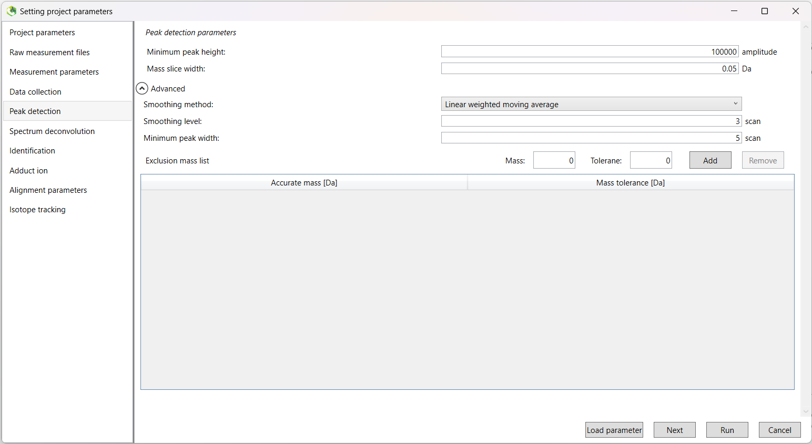
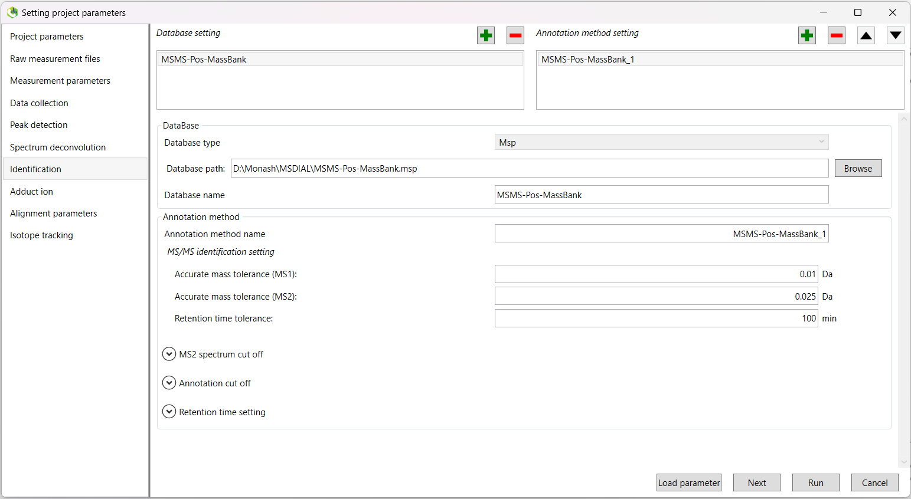
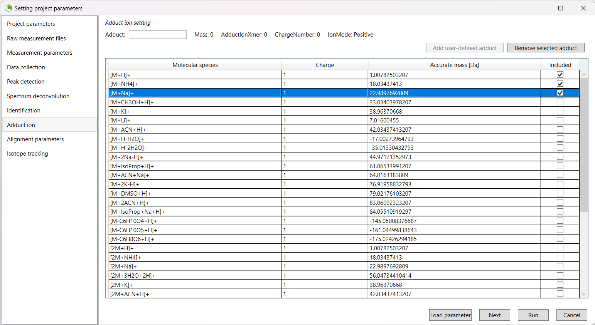
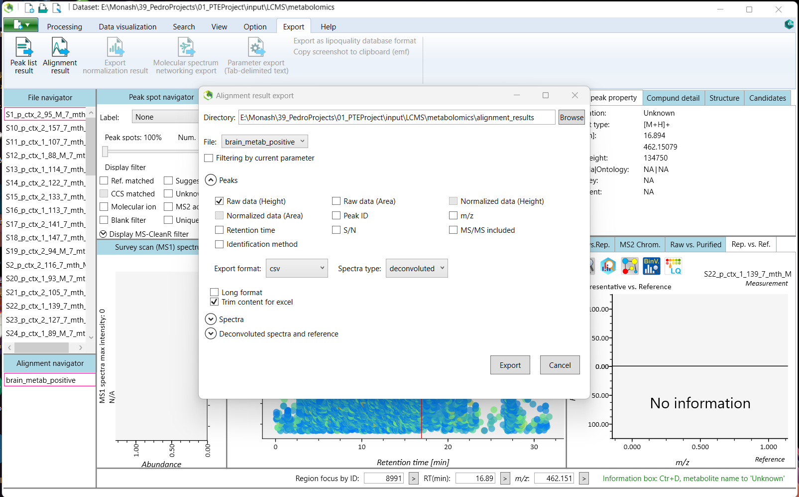
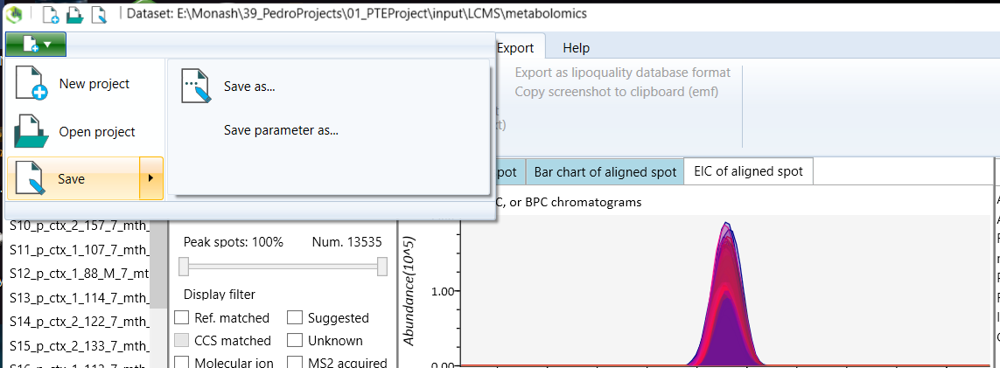

# Processing metabolome and lipidome data with MS-DIAL

MS-DIAL provides a pipeline for untargeted metabolomics. Here we will discuss the process for generating intensity height tables from raw LC-MS data, and subsequent export for downstream analysis and secondary annotation methods.

## Requirements :warning:

!!! info "Conversion of .RAW files"

    As of MS-DIAL version 4.70, it is no longer a requirement to convert your .RAW LC-MS files into .ABF format, however if you are using an older version of MS-DIAL, you will need to download the ABF file converter.

* [ABF File Converter](https://www.reifycs.com/AbfConverter/) (depending on MS-DIAL version).
* [MS-DIAL](http://prime.psc.riken.jp/compms/msdial/main.html) software for Windows.
* [MassBank MS/MS positive and negative database files](http://prime.psc.riken.jp/compms/msdial/main.html#MSP).
* The LC-MS files all present in a single folder.
* The LC-MS standards file generated during data collection (should contain columns for: metabolite name, m/z, and retention time).

## Setting up a new project 🏗️

!!! note

    The instructions given here are for MS-DIAL version 5.

Begin by opening MS-DIAL and starting a new project using the icon in the centre of the screen.

MS-DIAL will prompt you to enter a `Project title` and a `Project file path`. Please remember that the project file path must contain all of your raw LCMS files &ndash; you can navigate to this folder using the `'Browse'` button.

!!! tip "Change the default project name"

    It is recommended that you change the default `.mdproject` file name generated by MS-DIAL to something more easily recognisable in the future,
    such as `date_sampletype_ionisationmode.mtd`.

### Raw measurement files 🗂️

The next screen will ask you to define your `'Analysis file paths'`. Click the browse button, and select all of your LC-MS files.
Note that these must be located in the same folder as your project in order to be valid.

Once you have done this, you will need to change the `'Type'` column to indicate whether that sample is a sample, blank, QC, or standard.
It is also recommended, for quick analysis later on, to change the values in the `'Class ID'` column.

For example, in the `'Class ID'` column below, it is indicated what the sample type is (if you have multiple groups, you can specify these here),
and of note, while `MS2` samples are given a `'Type'` of `QC`, you can specify that they are their own class in this column.

If you were provided with information about the order in which your samples were actually run, you can input this in the `Analytical order` column. This will allow retention time correction. However, as the majority of our annotations will be provided by the Human Metabolome Database (HMDB), which does not take retention time into account, this step will be less important downstream. One benefit however will be for the alignment of peaks in the event you have significant retention time drift over the course of data acquisition.

Once you have finished, click `'Next'` to continue.

### Measurement parameters 📐

The next screen will ask you to select various parameters regarding how your data was acquired.

Firstly, you can define a project name. It is recommended that you change the default `.mddata` file name generated by MS-DIAL to something more easily recognisable in the future, such as `date_sampletype_ionisationmode.mddata`.

!!! info "File name suffix"

    No matter how you decide to name your files, ensure that you use the same name for both positive and negative ionisations, and end each with `_pos` and `_neg` respectively. If you don't, you won't be able to make easy use of the XML curation function to speed up your manual curation later on.

    * If you use `_positive` and `_negative` like the example below, you'll also be fine.
    * The key is the make sure the file base name is identical.

For our data, most of the default options will be appropriate. 

- Data type for both `MS1` and `MS2` should be set to `Profile data` for our data, acquired using a Thermo Fisher Scientific LCMS apparatus.
- Ensure you choose the correct `'Ion mode'` at the bottom left, either positive or negative ionisation. and that you select the correct `'Target omics'` from either metabolomics or lipidomics.

Click `Next` once complete.

## Analysis parameter settings 🔧

Each tab below covers the settings for a tab on MS-DIAL. Input the correct settings, and then proceed to running your samples.

=== "Data collection 📊"

    !!! tip "Load parameters"

        If you have a parameter configuration file, you can load it in via the `Load parameter` button in the bottom-left of the window.

    We begin the setting of analysis parameters by inputting the data collection parameters.

    **Mass Accuracy:**

    |               | Metabolomics | Lipidomics |
    |---------------|--------------|------------|
    | MS1 tolerance | 0.002 Da     | 0.002 Da   |
    | MS2 tolerance | 0.002 Da     | 0.002 Da   |

    **Data collection parameters:**

    |                        | Metabolomics | Lipidomics |
    |------------------------|--------------|------------|
    | Retention time begin   | 0 min        | 0 min      |
    | Retention time end     | 40 min       | 40 min     |
    | MS1 mass range begin   | 50 Da        | 200 Da     |
    | MS1 mass range end     | 1000 Da      | 1300 Da    |
    | MS/MS mass range begin | 50 Da        | 200 Da     |
    | MS/MS mass range end   | 1000 Da      | 1300 Da    |
    | Execute retention time correction | FALSE||

    !!! warning "Retention time correction option"

        You can choose here to perform retention time correction. This should typically be set to `FALSE` for at least your initial processing, and always set to `FALSE` if you do not have information about the analytical order of your samples.

    **Isotope recognition:**

    |                             | Metabolomics | Lipidomics |
    |-----------------------------|--------------|------------|
    | Maximum charged number      | 2            | 2          |
    | Consider Cl and Br elements | FALSE        | FALSE      |

    **Multithreading (will depend on your machine):**

    |                                    | Metabolomics | Lipidomics |
    |------------------------------------|--------------|------------|
    | Number of threads                  | 8            | 8          |
    | Execute retention time corrections | FALSE        | FALSE      |

    

=== "Peak detection 📈🔍"

    Next we select the minimum peak height threshold. Peaks below this threshold will not be retained.
    A value of `100,000` is recommended for data acquired by Thermo Fisher Scientific machines.
    However, this will vary by apparatus, and may require data-dependant tuning.

    We will leave the `'Mass slice width'` value to the default, along with all options in the drop-down `'Advanced'` menu.

    |                     | Metabolomics | Lipidomics |
    |---------------------|--------------|------------|
    | Minimum peak height | 100000       | 100000     |
    | Mass slice width    | 0.05 Da      | 0.05 Da    |

    

=== "Spectrum deconvolution 🌈🔬"

    The default values are suitable.

    |                                   | Metabolomics | Lipidomics |
    |-----------------------------------|--------------|------------|
    | Sigma window value                | 0.5          | 0.5        |
    | MS/MS abundance cut off           | 0            | 0          |
    | Exclude after precursor ion       | TRUE         | TRUE       |
    | Keep the isotopic ions until      | 5 Da       | 5 Da     |
    | Keep the isotopic ions w/o MS2Dec | FALSE        | FALSE      |

    

=== "Identification 🆔🔎"

    In this tab, you will add your databases as appropriate. One of these will be the appropriate `.msp` [MassBank database file](https://systemsomicslab.github.io/compms/msdial/main.html#MSP) (either positive or negative depending on the ionisation mode you are currently running).

    Click the **green tick** next the `Database setting` heading. In the `DataBase` box, select `Msp` as your database type and then navigate and select the appropriate MassBank file using the `Browse` button. The `Database name` and other values will be automatically populated.

    We will now adjust a number of parameters (the lipidomics columns are left blank below as you will not need to input or change anything).

    !!! info "Retention time tolerance"

        Keep in mind that the `Retention time tolerance` parameter can be adjusted in a project-specific manner. Using a value of about 2 minutes has worked well in the past, but may require fine-tuning. Setting the value lower will result in a greater number of highly similar features, and may result in issues downstream during manual curation steps.

    **MS/MS identification setting:**

    |                                  | Metabolomics | Lipidomics |
    |----------------------------------|--------------|------------|
    | Accurate mass tolerance (MS1)    | 0.002 Da     |            |
    | Accurate mass tolerance (MS2)    | 0.002 Da     |            |
    | Retention time tolerance     | 2 min        |            |

    We will leave the other drop-down menus with their default settings.

    

    In addition, you can select a text file containing the standards run during data acquisition.
    This file should contain three columns, including the metabolite name, m/z, and retention time (in that order).
    These columns should be named `Metabolite`, `MZ`, and `RT`.

    Click the **green tick** again to add another database. This time, choose `Text` as your database type. Navigate and select your standards file, and the other fields will be populated.

    Once again, we will change a few parameters:

    **Tolerance:**

    |                                  | Metabolomics | Lipidomics |
    |----------------------------------|--------------|------------|
    | Accurate mass tolerance (MS1)    | 0.002 Da     |            |
    | Retention time tolerance     | 2 min        |            |

    

=== "Adduct ion ➕⚛️"

    Here we will select the appropriate adduct ion settings for our runs.

    === "Metabolomics"

        | Metabolomics Positive | Metabolomics Negative |
        |-----------------------|-----------------------|
        | [M+H]+                | [M-H]-                |
        | [M+NH4]+              | [M+Na-2H]-            |
        | [M+Na]+               | [M+Cl]-               |

    === "Lipidomics"

        | Lipidomics Positive | Lipidomics Negative |
        |------------|---|
        | [M+H]+     | [M-H]- |
        | [M+NH4]+   | |

    

=== "Alignment parameters 🔗📏"

    Here, you should rename the `'Result name:'` to something more recognisable.
    For example, `alignment_data_sampletype_ionisation`.

    Set the `'Reference file:'` to your __second__ QC sample. The first QC sample is typically different than the others,
    and this will affect your results.

    The `'Retention time tolerance:'` parameter will be data-dependant, however a good start is to try either `2 min` or `1 min`.

    |                          | Metabolomics | Lipidomics |
    |--------------------------|--------------|------------|
    | Retention time tolerance | 2 min      | 2 min    |
    | MS1 tolerance            | 0.002 Da     | 0.002 Da   |

    There are also some other parameters we need to check in the `'Advanced'` drop-down menu.
    Because we don't remove the features based on blank information, the following three tick boxes are 'greyed out', and not available to
    change. You do not need to change the default options for these.

    !!! info "Gap filling"

        We will use `Gap filling by compulsion`, as it improves peak alignment (often resulting in fewer highly similar features), but you may choose to skip this step. The choice will largely be data-dependent, and with a higher retention time tolerance, you may not see much of a difference.

    |                                                | Metabolomics | Lipidomics |
    |------------------------------------------------|--------------|------------|
    | Retention time factor                          | 0.5          | 0.5        |
    | MS1 factor                                     | 0.5          | 0.5        |
    | Peak count filter                              | 0 %          | 0 %        |
    | N% detected in at least one group              | 0 %          | 0 %        |
    | Remove features based on blank information     | FALSE        | FALSE      |
    | Sample max / blank average                     | 5            | 5          |
    | Keep 'reference matched' metabolite features   | FALSE        | FALSE      |
    | Keep 'suggested (w/o MS2)' metabolite features | FALSE        | FALSE      |
    | Keep removable features and assign the tag     | FALSE        | FALSE      |
    | Gap filling by compulsion                      | TRUE        | TRUE      |

    

### Run the pipeline 🏃💻

Once you have finished setting up the analysis parameters, click `'Finish'` to begin the run.

When the run finishes, the data will appear on the screen. On the left-hand side of the screen, you will see an `'Alignment navigator'` box.
Double click the file that is inside to load all of your data at once.

## Viewing and exporting data 👀💾

The `'Show ion table'` button in the middle of the screen is a good place to start to see how many metabolites/lipids (features) were found during the run.
You can click the `'Metabolite name'` column to group all features that were annotated.

### Aligned spot information 📍📝

If you want to view more information about a specific feature, you can single click on the row within the ion table list.

At the top of the screen, the default image shown is the `'Bar chart of aligned spot (OH)'`. This will show you the average intensities
of each of your `'Class IDs'`.

To view the actual peak itself, you can click the adjacent `'EIC of aligned spot'` tab to view and assess the quality of the peak.
Good quality peaks, especially for smaller weight features, are tight and well-aligned (see the image below).

Next, if you want to see the individual peaks for each of your samples, you can right-click on the peak window and click the
`Peak curation (Sample table)` option. This will show you the peak for that feature for each sample so you can further
assess their quality. This will be necessary for manual curation of features later to confirm confidence in the annotation of significant findings.

After downstream pre-processing, you will come back to MS-DIAL and manually curate each of the features, removing those with poor-quality spectra.
It should be noted that without manual curation, your ordination plots (e.g. PCoA) will be affected by remaining poor quality features.

### Exporting for downstream processing and analysis 📤

There are a few useful things we can routinely export:

- The raw data height matrix (contains all of our intensity values and feature information).
- Analysis parameters (to streamline future analysis set-up).

!!! tip "Export as CSV"

    For consistency and easy import into R, best practice is to save the height matrix output in `.csv` format.

#### Height table export 📊📄
To export the raw height matrix table, navigate to the `'Alignment result'` option within the `'Export'` tab in the top menu.

Select the directory for export and leave all other options to their defaults. Change the `Export format` to `csv`, and click `'Export'`.

#### Parameter export 🛠️📤

To export the analysis parameters, open the green tab at the top-left of the screen with the new project icon, select `Save`, and then select the `Save parameter option`.

## Next steps ➡️

Now that you have your height matrices (positive and negative ionisation modes), you can proceed to automated quality control steps, using [Peak Matrix Processing](./pmp-quality-control.md).

## Rights

* Copyright ©️ 2024 Mucosal Immunology Lab, Monash University, Melbourne, Australia.
* `pmp` package: Jankevics A, Lloyd GR, Weber RJM (2021). pmp: Peak Matrix Processing and signal batch correction for metabolomics datasets. R package version 1.4.0.
* License: This pipeline is provided under the MIT license.
* Authors: M. Macowan and C. Pattaroni