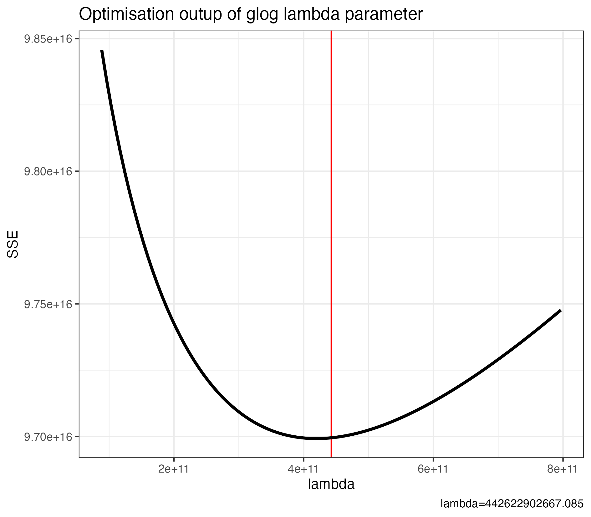

# Peak Matrix Processing for raw MS-DIAL height matrices

The raw height matrices output by MS-DIAL will typically contain thousands (if not tens of thousands) of so-called "uninformative" and "irreproducible" features.
Features such as these could hinder downstream analyses, including statistical analysis, biomarker discovery, or pathway inference.

Therefore the common practice is to apply peak matrix validation and filtering procedures as described in Di Guida et al. 
([2016](https://doi.org/10.1007/s11306-016-1030-9)), Broadhurst et al. ([2018](https://doi.org/10.1007/s11306-018-1367-3)),
and Schiffman et al. ([2019](https://doi.org/10.1186/s12859-019-2871-9)).

Functions within the `pmp` (Peak Matrix Processing) package are designed to help users to prepare data for further statistical data analysis in a fast, 
easy to use and reproducible manner.

## Preprocessing script 📜

An R function to handle the various steps is available as [`pmp_preprocess()`](../assets/LCMS/LCMS_preprocessing/pmp_preprocess.R), and will be explained in-depth below.

??? info "Parameters for `pmp_preprocess`"

    | Parameter | Description |
    | --- | --- |
    | `pos_df` | The positive ionisation intensity `data.frame`. |
    | `neg_df` | The negative ionisation intensity `data.frame`. |
    | `metadata` | The metadata `data.frame`. |
    | `samples_key` | Default: `'Sample'` &ndash; a universal string that is unique to the start of all samples (and not blanks or QCs etc.).  |
    | `intens_cols` | A vector of column numbers corresponding to columns with intensity values. |
    | `info_cols` | A vector of column numbers corresponding to the peak information. |
    | `blankFC` | Default: `5` &ndash; the minimum fold change above the average intensity of blanks in order for peaks (and samples) to be retained. |
    | `max_perc_mv` | Default: `0.8` &ndash; the maximum percentage of peaks that can be missing for a **sample** to be retained. |
    | `missingPeaksFraction` | Default: `0.8` &ndash; the maximum percentage of samples that can contain a missing value for a **peak** to be retained. |
    | `max_rsd` | Default: `25` &ndash; the maximum relative standard deviation of intensity values for a given peak within specified QC samples for that peak to be retained. |
    | `mv_imp_rowmax` | Default: `0.7` &ndash; the maximum percentage of missing values allowable in a given row for imputation. |
    | `mv_imp_colmax` | Default: `0.7` &ndash; the maximum percentage of missing values allowable in a given column for imputation. |
    | `mv_imp_method` | Default: `knn` &ndash; the method to be used for imputation. |

## R processing 🧮

### Environment setup 🛠️🌱

Firstly, we need to load the required packages. We will also display their versions for future reference.

```r title="Load the required packages"
# Get the R version
version$version.string

# Define a vector of required packages
pkgs <- c('here', 'data.table', 'tidyverse', 'kableExtra', 'ggplot2', 'pmp', 'SummarizedExperiment', 'S4Vectors')

# For each of the packages, load it and display the version number
for (pkg in pkgs) {
  suppressPackageStartupMessages(library(pkg, character.only = TRUE))
  print(paste0(pkg, ': ', packageVersion(pkg)))
}

# Set the seed for generation of pseudo-random numbers
set.seed(2)
```

Example output:

```bash
[1] "R version 4.0.5 (2021-03-31)"
[1] "here: 1.0.1"
[1] "data.table: 1.14.0"
[1] "tidyverse: 1.3.1"
[1] "kableExtra: 1.3.4"
[1] "ggplot2: 3.3.5"
[1] "pmp: 1.2.1"
[1] "SummarizedExperiment: 1.20.0"
[1] "S4Vectors: 0.28.1"
```

### Data import 📥

The data we will be importing is the height matrix data output from the MS-DIAL pipeline.
This output will be imported into a `SummarizedExperiment` object for pre-processing using the `pmp` package.

#### Metadata (optional at this stage) 🗂️

!!! question "Why should I include metadata now?"

    While this step is optional at this stage, the benefit of supplying metadata to the `SummarizedExperiment` object is that your metadata
    will also be filtered by the pre-processing steps to match the remaining samples and features at the end.

Firstly, we will import and prepare the metadata component of our `SummarizedExperiment` object.
For simplicity and economy of code, we can specify the column types of our metadata using the `col_types` parameter in the `read_csv()` function.
These will usually be one of:

* `'c'` = character
* `'f'` = factor
* `'n'` = numeric
* `'l'` = logical (i.e. boolean)

In this example, we will be working with LCMS data from a set of stool samples that were collected from different patients.

There are two metadata files: one that contains information about the samples themselves 
(e.g. sample name and ID, sampling site, and age at collection), and one that contains information about the patient 
(e.g. gender, disease type, other clinical metadata etc.). We will combine these two tables to produce a single metadata file for input
into the `SummarizedExperiment` object.

```r title="Import clinical metadata"
# Import the patient metadata (the 'here' function makes defining file paths much easier)
metadata_patient <- read_csv(here::here('data', 'patient_metadata.csv'), col_types = 'ffffnnccfnc')

# Import the metabolomics sample metadata
metadata_metab_stool <- read_csv(here::here('data', 'metadata_metabolomics.csv'), col_types = 'ffffn') %>%
  filter(origin == 'stool') %>% # filter for the stool metabolomics metadata alone (not from other sites)
  left_join(metadata_patient, by = c('patient' = 'ID')) %>% # match patient metadata onto the sample metadata rows using a matched column
  column_to_rownames(var = 'sample') # choose the value that matches the MS-DIAL height matrix column names to be the rownames
```

#### Stool metabolomics data 💩

We will load in both the positive and negative ionisation mode height matrices from the MS-DIAL pipeline.
We need to remove the MS/MS columns, as these were acquired in a different manner to the other columns.

Then, we can `rbind` the two tables together after denoting the original ionisation mode in the row names.
Because the QC data is incorporated within each feature (row), `pmp` can pre-process all of our data at once, and normalise the entire dataset.

```r title="Load the peak height tables from MS-DIAL"
# Load the metabolomics height data
metab_stool_pos <- read_csv(here::here('data', 'stool_metabolites_height_positive.csv'), skip = 4) # skip the first 4 rows
metab_stool_neg <- read_csv(here::here('data', 'stool_metabolites_height_negative.csv'), skip = 4)
```

### Run the preprocessing script 🏃

At this point, we can simply run the `pmp_preprocess()` function. You will just need to identify which of your columns relate to what, and this could change depending on the exact MS-DIAL version you are using.

1. **Information columns**: these contain general information including mass, retention time, signal-to-noise ratio, spectrum fill percentage etc. These may be columns `1:32`.
2. **Intensity columns**: these contain the actual intensity values associated with each sample-peak pair, and will vary depending on your LCMS run. 
   
!!! warning "Don't include the averaged columns"

    Ensure you do not include the group averages, and only include individual samples, blanks, and QC samples

```r
# Process stool data
metab_stool_pmp <- pmp_preprocess(pos_df = metab_stool_data_pos,
                                  neg_df = metab_stool_data_neg,
                                  metadata = metab_metadata,
                                  samples_key = 'stool',
                                  intens_cols = c(33:38, 45:60, 67:76),
                                  info_cols = 1:32,
                                  mv_imp_method = 'rf')

# Save output data
saveRDS(metab_stool_pmp, here::here('output', 'temp', 'metab_stool_pmp_temp.rds'))
```

!!! info "Skip ahead"

    If you run the script here, you can skip down to the [principle component analysis](#principle-component-analysis) step.

### Detailed steps 📝

If you have a more complex setup, or would rather just do things manually to fine tune each step, we describe here the individual steps that the `pmp_process()` function is performing.

#### Continue manual data import 🔄

```r title="Combine ionisation modes and prepare intensity and peak tables"
# Remove the MS/MS samples (not acquired in the same way)
metab_stool_pos <- metab_stool_pos[, !(names(metab_stool_pos) %in% c('MSMS_pos', 'MSMS_neg'))]
metab_stool_neg <- metab_stool_neg[, !(names(metab_stool_neg) %in% c('MSMS_pos', 'MSMS_neg'))]

# Separate into intensity and information data.frames for the SummarizedExperiment object
metab_stool_pos_counts <- as.matrix(metab_stool_pos[, c(33:54, 62:165)]) # you need to find the column numbers that contain Blanks, QCs, and samples
metab_stool_neg_counts <- as.matrix(metab_stool_neg[, c(33:54, 62:165)])

metab_stool_pos_info <- metab_stool_pos[, 1:32]
metab_stool_neg_info <- metab_stool_neg[, 1:32]

# Rename the data to indicate ionisation mode (using the MS-DIAL alignment ID)
stool_pos_rownames <- paste0(metab_stool_pos_info$`Alignment ID`, '_pos')
stool_neg_rownames <- paste0(metab_stool_neg_info$`Alignment ID`, '_neg')

rownames(metab_stool_pos_counts) <- stool_pos_rownames
rownames(metab_stool_pos_info) <- stool_pos_rownames
rownames(metab_stool_neg_counts) <- stool_neg_rownames
rownames(metab_stool_neg_info) <- stool_neg_rownames

# Merge the postive and negative ionisation modes using rbind
metab_stool_counts <- rbind(metab_stool_pos_counts, metab_stool_neg_counts)
metab_stool_info <- rbind(metab_stool_pos_info, metab_stool_neg_info)
```

Now that we have our intensity and feature information datasets, before we can import them into a `SummarizedExperiment` object,
we need to define class and group vectors so that `pmp` knows whether our variables are samples, QCs, or blanks.

The easiest way to achieve this is by getting the first two characters (a substring) of our column names,
and using these as indicators of the classes: `'Bl'` = blank, `'QC'` = QC etc.

```r title="Define sample classes and groups"
# Create class and group vectors
metab_stool_class <- substr(colnames(metab_stool_counts), start = 1, stop = 2)
metab_stool_group <- substr(colnames(metab_stool_counts), start = 1, stop = 2)
```

??? warning "Why didn't this work for me?"

    If you have samples that start with the same two letters as our ideal blanks (`'Bl'`) and quality control (`'QC'`) samples, then this process will not work.
    For example, if you have blood/serum samples that start with `'Bl'`, then these will need to be renamed.
    Alternatively, you may wish to manually define your classes and groups.

#### Import into a SummarizedExperiment object 📦

Now that we have our individual components ready, we can check that the metadata matches our sample data,
and then import everything into a single, unified `SummarizedExperiment` object for pre-processing with the `pmp` package.

```r title="Assemble a SummarizedExperiment object"
# Reorder the metadata rows so that they match the column order of samples in the counts data.frame (ignoring blanks and QCs)
metadata_metab_stool <- metadata_metab_stool[colnames(metab_stool_counts)[23:126], ] # use only column containing sample intensities

# Check that the metadata matches the samples
identical(rownames(metadata_metab_stool), colnames(metab_stool_counts)[23:126]) # should return 'TRUE'

# Create the SummarizedExperiment (SE) object
metab_stool_SE <- SummarizedExperiment(assays = list(counts = metab_stool_counts),
                                       metadata = list(metadata_metab_stool),
                                       rowData = list(info = metab_stool_info),
                                       colData = DataFrame(class = metab_stool_class))
```
#### Filtering on blank intensity 🧪⛔

The first filtering steps we will carry out are to replace any so-called "missing" values (i.e. 0 values) with `NA` so
they will be compatible with downstream filtering steps.

After this, we can filter peaks based on the intensity values of our blanks.

```r title="Filter on blank intensity"
# Check the original number of features
dim(metab_stool_SE)

# Replace missing values with NA to be compatible with downstream filtering
assay(metab_stool_SE) <- replace(assay(metab_stool_SE), assay(metab_stool_SE) == 0, NA)

# Filter peaks and optionally samples based on blanks
metab_stool_filt <- filter_peaks_by_blanks(df = metab_stool_SE,
                                           fold_change = 5, # 5-fold change
                                           classes = metab_stool_SE$class,
                                           remove_samples = TRUE,
                                           remove_peaks = TRUE,
                                           blank_label = 'Bl') # from the class vector
                                           
# Check the number of features/samples remaining
dim(metab_stool_filt)
```

Example output (dimension checks):

```bash
[1] 81334   126 # Original
[1] 71700   115 # After blank intensity filtering
```

#### Filtering on missing values and QC intensity variation 🧺🔎

Next, we can perform a few filtering steps based on missing values and degree of variation in the QC samples.

- `filter_samples_by_mv`: removal of samples containing a user-defined maximum percentage of missing values [see documentation](https://rdrr.io/bioc/pmp/man/filter_samples_by_mv.html). E.g. setting the `max_perc_mv` argument to 0.8 will remove all samples with at least 80% missing values.
- `filter_peaks_by_fraction`: removal of peaks based upon the relative proportion of samples containing non-missing values [see documentation](https://rdrr.io/bioc/pmp/man/filter_peaks_by_fraction.html).
- `filter_peaks_by_rsd`: removal of peaks based upon relative standard deviation of intensity values for a given feature within specified QC samples [see documentation](https://rdrr.io/bioc/pmp/man/filter_peaks_by_rsd.html).

!!! info "Relative standard deviation"

    As the name suggests, this value is dependent on the standard deviation that exists in your QC samples.
    As such, if there is substantial variation in your QC samples you have a couple of options:

    * Increase the `max_rsd` value &ndash; this is a threshold of the QC RSD% value, so maybe try `40` if `25` is too low.
    * Identify problematic QC samples &ndash; see if you can work out what the issue is, and remove that particular QC sample if appropriate.

```r title="Continue filtering process"
# Filter samples based on the percentage of missing values
metab_stool_filt <- filter_samples_by_mv(df = metab_stool_filt,
                                         max_perc_mv = 0.8) # remove samples where >80% of values are missing 
                                         
# Check the number of features/samples
dim(metab_stool_filt)

# Filter peaks based on missing values across all samples
metab_stool_filt <- filter_peaks_by_fraction(df = metab_stool_filt,
                                             min_frac = 0.8, # features should have values for >80% of samples
                                             classes = metab_stool_filt$class,
                                             method = 'across')

# Check the number of features/samples
dim(metab_stool_filt)

# Filter peaks based on the percentage of variation in the QC samples
metab_stool_filt <- filter_peaks_by_rsd(df = metab_stool_filt,
                                        max_rsd = 25,
                                        classes = metab_stool_filt$class,
                                        qc_label = 'QC')

# Check the number of features/samples
dim(metab_stool_filt)
```

Example output (dimension checks):

```bash
[1] 71700   115 # After filtering for missing values within peaks
[1] 17315   115 # After filtering for missing values across samples
[1] 11648   115 # After filtering out high variability in QC samples
```

#### PQN normalisation and glog scaling 📊⚖️

Finally we can normalise our data using probabilistic quotient normalisation (PQN) ([see documentation](https://rdrr.io/github/computational-metabolomics/pmp/man/pqn_normalisation.html)),
followed by missing value imputation (various method choices available; [see documentation](https://rdrr.io/github/computational-metabolomics/pmp/man/mv_imputation.html)), 
and then transform the data using a variance-stabling generalised logarithmic transformation ([see documentation](https://rdrr.io/github/computational-metabolomics/pmp/man/glog_transformation.html)).

!!! question "What is a glog transformation?"

    Generalised logarithmic (glog) transformation is a statistical technique that applies a modified logarithmic function to raw intensity data, thereby stabilising variance across both low and high intensity mass spectral features. The `glog_transformation` function uses QC samples to optimise the scaling factor lambda, and using the `glog_plot_optimised_lambda` function it’s possible to visualise if the optimisation of the given parameter has converged at the minima.

```r title="PQN normalise, impute missing values, and glog transform data"
# PQN data normalisation
metab_stool_norm <- pqn_normalisation(df = metab_stool_filt,
                                      classes = metab_stool_filt$class,
                                      qc_label = 'QC')
                                      
# Missing values imputation
metab_stool_imp <- mv_imputation(df = metab_stool_norm,
                                 rowmax = 0.7, # max % of missing data allowed in any row
                                 colmax = 0.7, # max % of missing data allowed in any column
                                 method = 'knn') # or rf, bcpa, sv, mn, md.
                                 
# Data scaling
metab_stool_glog <- glog_transformation(df = metab_stool_imp,
                                        classes = metab_stool_imp$class,
                                        qc_label = 'QC')

opt_lambda_stool <- processing_history(metab_stool_glog)$glog_transformation$lambda_opt

glog_plot_optimised_lambda(df = metab_stool_imp,
                           optimised_lambda = opt_lambda_stool,
                           classes = metab_stool_imp$class,
                           qc_label = 'QC')
```

Example plot:

<figure markdown="span">
    { align=center, width=60% }
</figure>

We can also check the number of assigned metabolites that remain.

```r title="Check number of named features"
# Recover RDS object if you used the pmp_preprocess function
metab_stool_pmp <- readRDS(here::here('output', 'temp', 'metab_stool_pmp_temp.rds'))
metab_stool_glog <- metab_stool_pmp$glog_results

# Number of assigned metabolites
table(rowData(metab_stool_glog)@listData[['info.Metabolite name']] != 'Unknown')
```

Example output (189 metabolites with assignments remain):

```bash
FALSE  TRUE 
11459   189 
```

### Principle component analysis 📈

We can now visualise the output data using a principle component analysis plot (PCA) plot.

```r title="Generate a PCA plot to visualise QC clustering"
# Recover RDS object if you used the pmp_preprocess function
metab_stool_pmp <- readRDS(here::here('output', 'temp', 'metab_stool_pmp_temp.rds'))
metab_stool_glog <- metab_stool_pmp$glog_results

# Perform the PCA and retrieve the explained variance values
PCA_stool <- prcomp(t(assay(metab_stool_glog)), center = TRUE)
varexp_stool <- c(summary(PCA_stool)$importance[2,1]*100,
                  summary(PCA_stool)$importance[2,2]*100)

# Create a dataset for plotting
data_PCA_stool <- cbind(data.frame(Samples = rownames(PCA_stool$x),
                                   PC1 = PCA_stool$x[,1],
                                   PC2 = PCA_stool$x[,2]),
                        class = metab_stool_glog$class)

# Plot results
(PCA_stool_plot <- ggplot(data_PCA_stool, aes(x = PC1, y = PC2)) +
    geom_point(aes(fill = class, color = factor(class))) +
    stat_ellipse(aes(fill = class), geom = 'polygon', type = 't', level = 0.9, alpha = 0.2) +
    labs(title = 'Stool Metabolomics',
         x = paste0('PC1 ', round(varexp_stool[1], 2), '%'),
         y = paste0('PC2 ', round(varexp_stool[2], 2), '%'))
)
```

Example plot:

<figure markdown="span">
    { align=center, width=60% }
</figure>

## Next steps ➡️

Now that you have finished initial quality control, and have an imputed, glog-normalised dataset, you can proceed to [secondary MS1 feature identification](./secondary-feature-annotation.md).

## Rights

* Copyright ©️ 2024 Mucosal Immunology Lab, Monash University, Melbourne, Australia.
* `pmp` package: Jankevics A, Lloyd GR, Weber RJM (2021). pmp: Peak Matrix Processing and signal batch correction for metabolomics datasets. R package version 1.4.0.
* License: This pipeline is provided under the MIT license.
* Authors: M. Macowan and C. Pattaroni