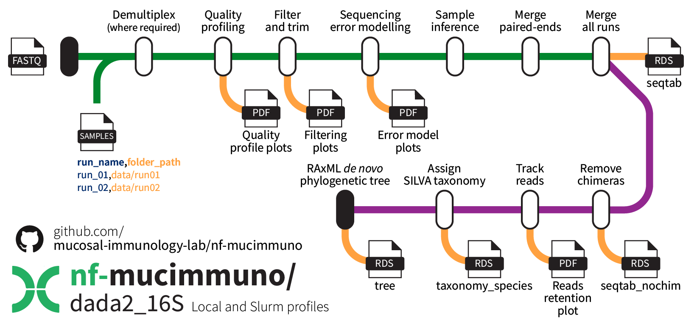

# DADA2 16S rRNA amplicon sequencing pre-processing

## Introduction

[**nf-mucimmuno/dada2_16S**](https://github.com/mucosal-immunology-lab/nf-mucimmuno/tree/main/dada2_16S) is a bioinformatics pipeline that can be used to run the popular DADA2 pre-processing pipeline for bacterial 16S rRNA amplicon sequencing data. It can handle multiple runs to generate a single unified output. It takes a samplesheet and either pre- or post-demultiplexed data (depending on what you have available), performs quality profiling, filtering and trimming, sequencing error modelling, sample inference, and merging of paired ends. From there, it combines all runs together, removes chimeras, assigns SILVA taxonomy, and generates a *de novo* phylogenetic tree using RAxML.



!!! tip

    This is essentially the Nextflow version of our DADA2 pipeline guide, which you can explore [here](../Microbiome/dada2_pipeline.md).

## Usage

### Download the repository 📁

This repository contains the relevant Nextflow workflow components, including a conda environment and submodules, to run the pipeline. To retrieve this repository alone, run the `retrieve_me.sh` script above.

!!! warning "Git version requirements"
  
    Git `sparse-checkout` is required to retrieve just the **nf-mucimmuno/scRNAseq** pipeline. It was only introduced to Git in version 2.27.0, so ensure that the loaded version is high enough (or that there is a version loaded on the cluster at all). As of July 2024, the M3 MASSIVE cluster has version 2.38.1 available.

```bash
# Check git version
git --version

# Load git module if not loaded or insufficient version
module load git/2.38.1
```

First, create a new bash script file.

```bash
# Create and edit a new file with nano
nano retrieve_me.sh
```

Add the contents to the file, save, and close.

```bash
#!/bin/bash

# Define variables
REPO_URL="https://github.com/mucosal-immunology-lab/nf-mucimmuno"
REPO_DIR="nf-mucimmuno"
SUBFOLDER="dada2_16S"

# Clone the repository with sparse checkout
git clone --no-checkout $REPO_URL
cd $REPO_DIR

# Initialize sparse-checkout and set the desired subfolder
git sparse-checkout init --cone
git sparse-checkout set $SUBFOLDER

# Checkout the files in the subfolder
git checkout main

# Move the folder into the main folder and delete the parent
mv $SUBFOLDER ../
cd ..
rm -rf $REPO_DIR

echo "Subfolder '$SUBFOLDER' has been downloaded successfully."
```

Then run the script to retrieve the repository into a new folder called `dada2_16S`, which will house your workflow files and results.

```bash
# Run the script
bash retrieve_me.sh
```

### Create the conda environment 🐍

To create the conda environment, use the provided environment `.yaml` file. Then activate it to access required functions.

```bash
# Create the environment
mamba env create -f environment.yaml

# Activate the environment
mamba activate nextflow-dada2
```

### Folder structure 🗂️

Because you specify the full directory path for your raw input data, you can technically house them however and wherever you like. However, below is an example of how to store runs depending on whether you have demultiplexed files or the pre-demultiplexed sequencing files.

!!! info "The pipeline just looks for a `demultiplexed` folder inside each run"

    Essentially if there's an existing folder called `demultiplexed`, demultiplexing is skipped for that run, and the existing files are used.

    - `run01` requires demultiplexing, and as such simply includes `R1.fastq.gz`, `R2.fastq.gz`, and `Index.fastq.gz`. It also importantly contains a barcode mapping file which provides a link between the unique adapters and each sample.
    - `run02` however is already demultiplexed, and therefore only requires the forward (`R1`) and reverse (`R2`) reads for each sample.
    
    !!! warning "Make sure you correctly name your barcode mapping file!"

        For runs requiring demultiplexing, the barcode mapping file must include the string `barcode_to_sample` in its filename.

```bash
dada2_16S/
    └── data/
        ├── run01/
        │   ├── barcode_to_sample_run01.txt
        │   ├── Index.fastq.gz
        │   ├── R1.fastq.gz
        │   └── R2.fastq.gz
        └── run02/
            └── demultiplexed/
                ├── sample1-R1.fastq.gz
                ├── sample1-R2.fastq.gz
                ├── sample2-R1.fastq.gz
                ├── sample2-R2.fastq.gz
                └── ...
```

### Prepare your sample sheet ✏️

This pipeline requires a sample sheet to identify where your sequencing data is located. You can also change the name of your run to something some specific if you desire from the original folder name.

Your sample sheet should look as follows, **ensuring you use the exact column names as below**.

!!! warning "File paths on M3"

    Remember that on the M3 MASSIVE cluster, you need to use the **full file path** &ndash; relative file paths don't usually work.

```bash
run_name,folder_path
run_01,/path_to_pipeline/dada2_16S/data/run01
run_02,/path_to_pipeline/dada2_16S/data/run02
```

An example is provided [here](./sample_sheet.csv).

### Running the pipeline 🏃

Now you can run the pipeline. You will need to set up a parent job to run each of the individual jobs &ndash; this can be either an interactive session, or an sbatch job. For example:

```bash
# Start an interactive session with minimal resources
smux n --time=3-00:00:00 --mem=16GB --ntasks=1 --cpuspertask=2 -J nf-STARsolo
```

!!! warning "Set the correct sample sheet location"

    Make sure you alter the `nextflow.config` file to provide the path to your sample sheet, unless it is `./samplesheet.csv` which is the default for the cluster profile. Stay within the top `cluster` profile section to alter settings for Slurm-submitted jobs.

Inside your interactive session, be sure to activate your `nextflow-dada2` environment from above. Then, **inside the dada2_16S folder**, begin the pipeline using the following command (ensuring you use the `cluster` profile to make use of the Slurm workflow manager).

```bash
# Activate conda environment
mamba activate nextflow-dada2

# Begin running the pipeline
nextflow run dada2_pipeline.nf -resume -profile cluster
```

#### Customisation ⚙️

There are some customisation options that are available within the `nextflow.config` file. While the defaults should be suitable for those with access to the M3 MASSIVE cluster genomics partition, for those without access, of for those who require different amounts of resources, there are ways to change these.

To adjust the `cluster` profile settings, stay within the appropriate section at the top of the file.

??? info "Parameters"

    | Option | Description |
    | --- | --- |
    | sample_sheet | The file path to your sample sheet (default: `'./samplesheet.csv'`) |
    | outdir | A new folder name to be created for your results (default: `'results'`) |
    | *filter_and_trim*.truncLen | Reads should be truncated after this many bases (default: `'240,240'`) |
    | *filter_and_trim*.maxEE | After truncation, reads with higher than `maxEE` expected error will be discarded (default: `'4,4'`) |
    | *filter_and_trim*.trimLeft | The number of bases that should be trimmed from the left-hand side of the read &ndash; helps to remove custom primers and improve data retention, but may need to be set to zeros depending on your data (default: `'54,54'`) |
    | *filter_and_trim*.truncQ | Reads will be truncated at the first instance of a quality score less than or equal to this (default: `'2,2'`) |
    | *filter_and_trim*.maxN | After truncation, sequences with more than `maxN` `N` bases will be discarded (default: `'0,0'`) |
    | *assign_taxonomy*.trainSet_link | The link to the DADA2-formatted SILVA training dataset |
    | *assign_taxonomy*.trainSet_file | The desired file name for the DADA2-formatted SILVA training dataset |
    | *assign_taxonomy*.assignSpecies_link | The link to the DADA2-formatted species assignment dataset |
    | *assign_taxonomy*.assignSpecies_file | The desired file name for the DADA2-formatted species assignment dataset |

    The DADA2-ready SILVA taxonomic data is sourced from [here](https://zenodo.org/records/14169026). If new updates become available, feel free to update these values (or let us know so we can update).

    !!! info "Read-specific filter and trim settings"

        Although the defaults use the same parameter values for both forward and reverse reads, you can set specific ones.
        For example, in the `filter_and_trim.truncLen` parameter of `'240,240'`, the first value is for the forward (`R1`) read, and the second is for the reverse (`R2`) read. These can be set independently of each other.

??? info "Process"

    These settings relate to resource allocation and cluster settings. DE_NOVO_PHYLO_TREE is the only step that will likely longer than 4 hours for typical runs, and therefore the default option is to run this steps on the `comp` partition. Depending on how many runs you have, other steps may exceed the wall-time too; adjust as required.

    | Option | Description |
    | --- | --- |
    | executor | The workload manager (default: `'slurm'`) |
    | conda | The conda environment to use (default: `'./environment.yaml'`) |
    | queueSize | The maximum number of jobs to be submitted at any time (default: `12`) |
    | submitRateLimit | The rate allowed for job submission &ndash; either a number of jobs per second (e.g. 20sec) or a number of jobs per time period (e.g. 20/5min) (default: `'1/2sec'`) |
    | memory | The maximum global memory allowed for Nextflow to use (default: `'320 GB'`) |
    | *DEMULTIPLEX*.memory | Memory for DEMULTIPLEX step to use (default: `'52 GB'`) |
    | *DEMULTIPLEX*.cpus | Number of CPUs for DEMULTIPLEX step to use (default: `'8'`) |
    | *DEMULTIPLEX*.clusterOptions | Specific cluster options for DEMULTIPLEX step to use (default: `'--time=4:00:00 --partition=genomics --partition=genomics'`) |
    | *ERROR_MODEL*.memory | Memory for ERROR_MODEL step to use (default: `'52 GB'`) |
    | *ERROR_MODEL*.cpus | Number of CPUs for ERROR_MODEL step to use (default: `'8'`) |
    | *ERROR_MODEL*.clusterOptions | Specific cluster options for ERROR_MODEL step to use (default: `'--time=4:00:00 --partition=genomics --partition=genomics'`) |
    | *MERGE_PAIRED_ENDS*.memory | Memory for MERGE_PAIRED_ENDS step to use (default: `'52 GB'`) |
    | *MERGE_PAIRED_ENDS*.cpus | Number of CPUs for MERGE_PAIRED_ENDS step to use (default: `'8'`) |
    | *MERGE_PAIRED_ENDS*.clusterOptions | Specific cluster options for MERGE_PAIRED_ENDS step to use (default: `'--time=4:00:00 --partition=genomics --partition=genomics'`) |
    | *REMOVE_CHIMERAS*.memory | Memory for REMOVE_CHIMERAS step to use (default: `'52 GB'`) |
    | *REMOVE_CHIMERAS*.cpus | Number of CPUs for REMOVE_CHIMERAS step to use (default: `'8'`) |
    | *REMOVE_CHIMERAS*.clusterOptions | Specific cluster options for REMOVE_CHIMERAS step to use (default: `'--time=4:00:00 --partition=genomics --partition=genomics'`) |
    | *ASSIGN_TAXONOMY*.memory | Memory for ASSIGN_TAXONOMY step to use (default: `'52 GB'`) |
    | *ASSIGN_TAXONOMY*.cpus | Number of CPUs for ASSIGN_TAXONOMY step to use (default: `'8'`) |
    | *ASSIGN_TAXONOMY*.clusterOptions | Specific cluster options for ASSIGN_TAXONOMY step to use (default: `'--time=4:00:00 --partition=genomics --partition=genomics'`) |
    | *DE_NOVO_PHYLO_TREE*.memory | Memory for v step to use (default: `'160 GB'`) |
    | *DE_NOVO_PHYLO_TREE*.cpus | Number of CPUs for DE_NOVO_PHYLO_TREE step to use (default: `'24'`) |
    | *DE_NOVO_PHYLO_TREE*.clusterOptions | Specific cluster options for DE_NOVO_PHYLO_TREE step to use (default: `'--time=24:00:00'`) |

## Outputs

Several outputs will be copied from their respective Nextflow `work` directories to the output folder of your choice (default: `results`).

### Phyloseq inputs 📦

The main outputs of interest for downstream processing are the inputs to create your `phyloseq` object.

| Output | Description |
| --- | --- |
| `seqtab_nochim.rds` | The clean counts table matrix |
| `taxonomy_species.rds` | The SILVA-assigned taxonomy table |
| `tree.rds` | The *de novo* phylogenetic tree |

### QC and filtering plots 📊

There are also a collection of quality control and filtering plots available in this directory too. Below is an example of the output structure for running a single run.

```bash
dada2_16S/
    ├── run01/
    │   └── filtering_report/
    │       └── run01_filtered/
    │           ├── error_model.pdf
    │           ├── error_model.pdf.rds
    │           ├── error_model.rds
    │           ├── filtering_report.pdf
    │           ├── filtering_report.pdf.rds
    │           ├── sample1-R1.fastq
    │           ├── sample1-R2.fastq
    │           ├── sample2-R1.fastq
    │           ├── sample2-R2.fastq
    │           └── ...
    ├── aggregated_error_plots.pdf
    ├── aggregated_filtering_plots.pdf
    ├── aggregated_quality_profiles.pdf
    ├── length_distribution.pdf
    ├── length_distribution.rds
    ├── read_tracking_report.pdf
    ├── seqtab_nochim.rds
    ├── seqtab_nochim.txt
    ├── seqtab.rds
    ├── taxonomy_species.rds
    ├── taxonomy_species.txt
    ├── taxonomy.rds
    ├── taxonomy.txt
    └── tree.rds
```

## Rights

- Copyright ©️ 2025 Mucosal Immunology Lab, Monash University, Melbourne, Australia.
- Licence: This pipeline is provided under the MIT license.
- Authors: M. Macowan

!!! info ""

    - Illumina Utils: [Meren Lab](https://github.com/merenlab/illumina-utils)
    - DADA2: [Benjamin Callahan et al.](https://github.com/benjjneb/dada2)
    - SILVA: [arb-silva.de](https://www.arb-silva.de/)
    - RAxML: [Exelixis Lab](https://cme.h-its.org/exelixis/web/software/raxml/)
    - phangorn: [Klaus Schliep et al.](https://github.com/KlausVigo/phangorn)
    - ips: [Christoph Heibl et al.](https://github.com/heibl/ips)