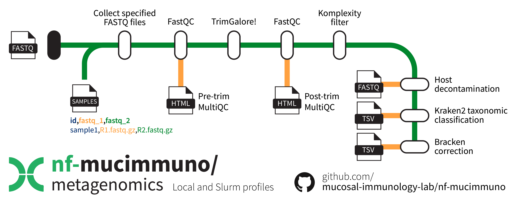

# Shotgun metagenomics sequencing pre-processing

## Introduction 📖

[**nf-mucimmuno/metagenomics**](https://github.com/mucosal-immunology-lab/nf-mucimmuno/tree/main/metagenomics) is a bioinformatics pipeline that can be used for pre-processing of shotgun metagenomics sequencing reads. It takes a sample sheet and raw sequencing `.fastq.gz` files, performs quality profiling, filtering and trimming, removal of low complexity reads, and host decontamination. MultiQC is run on the FastQC outputs both before and after TrimGalore! for visual inspection of sample quality &ndash; output `.html` files are collected in the results. Reads are then assigned taxonomic classifications using Kraken2 and abundance-corrected via Bracken.

{ align=center }

!!! info "Citation"

    If you use this workflow and end up publishing something, please consider including a reference to our work! 😎🙏

    Macowan, M., Pattaroni, C., & Marsland, B. (2025). nf-mucimmuno/metagenomics (0.1.0). Zenodo. https://doi.org/10.5281/zenodo.15743010

## Usage

### Download the repository 📁

This repository contains the relevant Nextflow workflow components, including a conda environment and submodules, to run the pipeline. To retrieve this repository alone, run the [`retrieve_me.sh`](../assets/Microbiome/metagenomics/retrieve_me.sh) script. Alternatively, you can prepare your own download script by following the instructions below.

!!! warning "Git version requirements"
  
    Git `sparse-checkout` is required to retrieve just the **nf-mucimmuno/metagenomics** pipeline. It was only introduced to Git in version 2.27.0, so ensure that the loaded version is high enough (or that there is a version loaded on the cluster at all). As of July 2024, the M3 MASSIVE cluster has version 2.38.1 available.

```bash
# Check git version
git --version

# Load git module if not loaded or insufficient version
module load git/2.38.1
```

First, create a new bash script file.

```bash
# Create and edit a new file with nano
nano retrieve_me.sh
```

Add the contents to the file, save, and close.

```bash
#!/bin/bash

# Define variables
REPO_URL="https://github.com/mucosal-immunology-lab/nf-mucimmuno"
REPO_DIR="nf-mucimmuno"
SUBFOLDER="metagenomics"

# Clone the repository with sparse checkout
git clone --no-checkout $REPO_URL
cd $REPO_DIR

# Initialize sparse-checkout and set the desired subfolder
git sparse-checkout init --cone
git sparse-checkout set $SUBFOLDER

# Checkout the files in the subfolder
git checkout main

# Move the folder into the main folder and delete the parent
mv $SUBFOLDER ../
cd ..
rm -rf $REPO_DIR

echo "Subfolder '$SUBFOLDER' has been downloaded successfully."
```

Then run the script to retrieve the repository into a new folder called `metagenomics`, which will house your workflow files and results.

```bash
# Run the script
bash retrieve_me.sh
```

### Create the conda environment 🐍

To create the conda environment, use the provided environment `.yaml` file. Then activate it to access required functions.

```bash
# Create the environment
mamba env create -f environment.yaml

# Activate the environment
mamba activate nextflow-metaG
```

### Setting up your folders 🗂️

Because you specify the full directory path for your raw input data, you can technically house them however and wherever you like. However, below is an example of how to store your raw sequencing files.

```bash
metagenomics/
    ├── modules/
    ├── data/
    │   └── raw_fastq/
    │       ├── sample1_R1.fastq.gz
    │       ├── sample1_R2.fastq.gz
    │       ├── sample2_R1.fastq.gz
    │       ├── sample2_R2.fastq.gz
    │       └── ...
    ├── metaG_pipeline.nf
    ├── nextflow.config
    ├── retrieve_me.sh
    └── sample_sheet.csv
```

!!! tip "You don't have to have paired-end reads"

    Although the example folder structure above shows paired-end reads, the pipeline will handle both single- and paired-end reads.
    You will be able to define this all in your sample sheet, as shown below.

### Prepare your sample sheet 📝

This pipeline requires a sample sheet to identify where your sequencing data is located. You can also change the name of each sample to something some specific if you desire from the original folder name.

Your sample sheet should look as follows, **ensuring you use the exact column names as below**. You can also just edit the sample sheet already in the folder.

```bash
id,fastq_1,fastq_2
sample1,./data/raw_fastq/sample1.fastq.gz,
sample2,./data/raw_fastq/sample2_R1.fastq.gz,./data/raw_fastq/sample2_R2.fastq.gz
sample3,./data/raw_fastq/sample3_R1.fastq.gz,./data/raw_fastq/sample3_R2.fastq.gz
```

!!! info "Sample sheets columns"

    You simply require the column names `id`, `fastq_1`, and `fastq_2`.
    If you are working with single-ended data, simply leave the `fastq_2` column blank for the relevant samples.

### Running the pipeline 🏃

Now you can run the pipeline. You will need to set up a parent job to run each of the individual jobs &ndash; this can be either an interactive session, or an sbatch job. For example:

```bash
# Start an interactive session with minimal resources
smux n --time=3-00:00:00 --mem=16GB --ntasks=1 --cpuspertask=2 -J nf-metaG
```

!!! warning "Set the correct sample sheet location"

    Make sure you alter the `nextflow.config` file to provide the path to your sample sheet, unless it is `./sample_sheet.csv` which is the default for the cluster profile. Stay within the top `cluster` profile section to alter settings for Slurm-submitted jobs.

Inside your interactive session, be sure to activate your `nextflow-metaG` environment from above. Then, **inside the metagenomics folder**, begin the pipeline using the following command (ensuring you use the `cluster` profile to make use of the Slurm workflow manager).

```bash
# Activate conda environment
mamba activate nextflow-metaG

# Begin running the pipeline
nextflow run metaG_pipeline.nf -resume -profile cluster
```

#### Customisation ⚙️

There are several customisation options that are available within the `nextflow.config` file. While the defaults should be suitable for those with access to the M3 MASSIVE cluster genomics partition, for those without access, of for those who require different amounts of resources, there are ways to change these.

To adjust the `cluster` profile settings, stay within the appropriate section at the top of the file. The `local` settings are at the bottom.

??? info "Parameters"

    | Option | Description |
    |---|---|
    | samples_csv | The file path to your sample sheet |
    | outdir | A new folder name to be created for your results |
    | *trimgalore*.quality | The minimum quality score for, after which reads will be truncated to remove low-quality read ends. (Default: `20`) |
    | *trimgalore*.length | The minimum post-trimming read length required for a read to be retained. (Default: `25`) |
    | *trimgalore*.adapter | Adapter sequence to be trimmed from R1. Defaults to the Illumina adapters. (Default: `'AGATCGGAAGAGCACACGTCTGAACTCCAGTCAC'`) |
    | *trimgalore*.adapter2 | Adapter sequence to be trimmed from R1. Defaults to the Illumina adapters. (Default: `'AGATCGGAAGAGCGTCGTGTAGGGAAAGAGTGT'`) |
    | *decontaminate*.hostIndex | The base file path to the host index `.b2tl` files. Be sure to just provide the base name, e.g. `'path/to/folder/chm13v2.0_GRCh38_full_plus_decoy'`. If you don't provide anything, the pipeline will generate the host index for you and place a copy in the results folder. (Default: `''`) |
    | *taxonomy*.kraken2_db | The folder path to the kraken2 database if you have one prepared. If you don't provide anything, the pipeline will generate it for you and place a copy in the results folder. (Default: `''`) |
    | *taxonomy*.kmer_length | The sliding kmer length for Kraken2 to use for generating the database. This will also be used for generating the Bracken-corrected database version. (Default: `35`) |
    | *bracken*.bracken_level | The level to which Bracken taxonomy should be corrected. (Default: `'S'` - i.e. species) |

??? info "Process"

    These settings relate to resource allocation and cluster settings. Database building steps in particular take longer than 4 hours, and therefore the default option is to run these steps on the `comp` partition.

    | Option | Description |
    | --- | --- |
    | executor | The workload manager (default: `'slurm'`) |
    | conda | The conda environment to use (default: `'./environment.yaml'`) |
    | queueSize | The maximum number of jobs to be submitted at any time (default: `12`) |
    | submitRateLimit | The rate allowed for job submission &ndash; either a number of jobs per second (e.g. 20sec) or a number of jobs per time period (e.g. 20/5min) (default: `'1/2sec'`) |
    | memory | The maximum global memory allowed for Nextflow to use (default: `'320 GB'`) |
    | *FASTQC*.memory | Memory for FASTQC step to use (default: `'80 GB'`) |
    | *FASTQC*.cpus | Number of CPUs for FASTQC step to use (default: `'8'`) |
    | *FASTQC*.clusterOptions | Specific cluster options for FASTQC step to use (default: `'--time=8:00:00'`) |
    | *TRIMGALORE*.memory | Memory for TRIMGALORE step to use (default: `'80 GB'`) |
    | *TRIMGALORE*.cpus | Number of CPUs for TRIMGALORE step to use (default: `'8'`) |
    | *TRIMGALORE*.clusterOptions | Specific cluster options for TRIMGALORE step to use (default: `'--time=8:00:00'`) |
    | *KOMPLEXITY_FILTER*.memory | Memory for KOMPLEXITY_FILTER step to use (default: `'80 GB'`) |
    | *KOMPLEXITY_FILTER*.cpus | Number of CPUs for KOMPLEXITY_FILTER step to use (default: `'12'`) |
    | *KOMPLEXITY_FILTER*.clusterOptions | Specific cluster options for KOMPLEXITY_FILTER step to use (default: `'--time=4:00:00 --partition=genomics --partition=genomics'`) |
    | *PREPARE_HOST_GENOME*.memory | Memory for PREPARE_HOST_GENOME step to use (default: `'40 GB'`) |
    | *PREPARE_HOST_GENOME*.cpus | Number of CPUs for PREPARE_HOST_GENOME step to use (default: `'8'`) |
    | *PREPARE_HOST_GENOME*.clusterOptions | Specific cluster options for PREPARE_HOST_GENOME step to use (default: `'--time=24:00:00'`) |
    | *HOST_DECONTAMINATE*.memory | Memory for HOST_DECONTAMINATE step to use (default: `'80 GB'`) |
    | *HOST_DECONTAMINATE*.cpus | Number of CPUs for HOST_DECONTAMINATE step to use (default: `'12'`) |
    | *HOST_DECONTAMINATE*.clusterOptions | Specific cluster options for HOST_DECONTAMINATE step to use (default: `'--time=4:00:00 --partition=genomics --partition=genomics'`) |
    | *PREPARE_KRAKEN2_DB*.memory | Memory for PREPARE_KRAKEN2_DB step to use (default: `'120 GB'`) |
    | *PREPARE_KRAKEN2_DB*.cpus | Number of CPUs for PREPARE_KRAKEN2_DB step to use (default: `'24'`) |
    | *PREPARE_KRAKEN2_DB*.clusterOptions | Specific cluster options for PREPARE_KRAKEN2_DB step to use (default: `'--time=24:00:00'`) |
    | *CLASSIFY_KRAKEN2*.memory | Memory for CLASSIFY_KRAKEN2 step to use (default: `'120 GB'`) |
    | *CLASSIFY_KRAKEN2*.cpus | Number of CPUs for CLASSIFY_KRAKEN2 step to use (default: `'16'`) |
    | *CLASSIFY_KRAKEN2*.clusterOptions | Specific cluster options for CLASSIFY_KRAKEN2 step to use (default: `'--time=4:00:00 --partition=genomics --partition=genomics'`) |
    | *MERGE_KRAKEN2_REPORTS*.memory | Memory for MERGE_KRAKEN2_REPORTS step to use (default: `'40 GB'`) |
    | *MERGE_KRAKEN2_REPORTS*.cpus | Number of CPUs for MERGE_KRAKEN2_REPORTS step to use (default: `'6'`) |
    | *MERGE_KRAKEN2_REPORTS*.clusterOptions | Specific cluster options for MERGE_KRAKEN2_REPORTS step to use (default: `'--time=4:00:00 --partition=genomics --partition=genomics'`) |
    | *PREPARE_BRACKEN_DB*.memory | Memory for PREPARE_BRACKEN_DB step to use (default: `'120 GB'`) |
    | *PREPARE_BRACKEN_DB*.cpus | Number of CPUs for PREPARE_BRACKEN_DB step to use (default: `'24'`) |
    | *PREPARE_BRACKEN_DB*.clusterOptions | Specific cluster options for PREPARE_BRACKEN_DB step to use (default: `'--time=24:00:00'`) |

!!! warning "Nextflow Error Status (137)"

    Nextflow error status (137) relates to insufficent RAM allocated to the job. If you get this error, try allocating more resources to the job that failed.

## Outputs 📤

Several outputs will be copied from their respective Nextflow `work` directories to the output folder of your choice (default: `results`).

The main outputs of interest for downstream processing are your Bracken-corrected `.tsv` file and your trimmed, decontaminated reads.

| Output | Description |
| --- | --- |
| `filtered_combined_bracken_report.tsv` | The Bracken-corrected clean counts table matrix |
| `decontam/` | A folder containing all of your trimmed, decontaminated `.fastq.gz` files &ndash; these can be used for other pipelines such as HUMAnN3 functional profiling. |

**Folder structure**

There are also a collection of quality control outputs and database files (if you didn't provide them to the pipeline) available in this directory too. If the pipeline generated the databases for you, it is recommended that you move these somewhere else so you can use them in future to save yourself some time. Below is an example of the output structure after running the pipeline.

```bash
results/
    ├── kraken2/
    │   ├── combined_kraken2_report.tsv
    │   ├── filtered_combined_kraken2_report.tsv
    │   ├── sample1.kraken
    │   ├── sample1.report
    │   └── ...
    ├── bracken/
    │   ├── combined_bracken_report.tsv
    │   └── filtered_combined_bracken_report.tsv
    ├── decontam/
    │   ├── sample1_decontam.fq.gz
    │   ├── sample2_R1_decontam.fq.gz
    │   ├── sample2_R2_decontam.fq.gz
    │   └── ...
    ├── decontam_log/
    │   ├── sample1_bowtie2.log
    │   ├── sample2_bowtie2.log
    │   └── ...
    ├── kraken2_database/ # ~470 GB
    │   ├── database.kraken # 50.2 GB
    │   ├── database35mers.kmer_distrib
    │   ├── database35mers.kraken
    │   ├── hash.k2d # 90.9 GB
    │   ├── opts.k2d
    │   ├── seqid2taxid.map
    │   ├── taxo.k2d
    │   ├── library/ ... # ~ 223 GB
    │   └── taxonomy/ ... # ~ 46.4 GB
    ├── hostIndex/ # ~18.2 GB
    │   ├── chm13v2.0_GRCh38_full_plus_decoy.1.bt2l
    │   ├── chm13v2.0_GRCh38_full_plus_decoy.2.bt2l
    │   ├── chm13v2.0_GRCh38_full_plus_decoy.3.bt2l
    │   ├── chm13v2.0_GRCh38_full_plus_decoy.4.bt2l
    │   ├── chm13v2.0_GRCh38_full_plus_decoy.rev.1.bt2l
    │   ├── chm13v2.0_GRCh38_full_plus_decoy.rev.2.bt2l
    │   └── chm13v2.0_GRCh38_full_plus_decoy.fasta
    ├── reports/
    │   ├── pretrim_multiqc_report.html
    │   └── posttrim_multiqc_report.html
    ├── taxonomy.txt
    └── tree.rds
```

## Rights

- Copyright ©️ 2025 Mucosal Immunology Lab, Monash University, Melbourne, Australia.
- Licence: This pipeline is provided under the MIT license.
- Authors: M. Macowan

!!! info ""

    - **FastQC**: Andrews, S. (2010). FastQC: A Quality Control Tool for High Throughput Sequence Data [Online]. Available online at: http://www.bioinformatics.babraham.ac.uk/projects/fastqc/
    - **MultiQC**: Ewels P, Magnusson M, Lundin S, Käller M. MultiQC: summarize analysis results for multiple tools and samples in a single report. Bioinformatics. 2016 Oct 1;32(19):3047-8. doi: 10.1093/bioinformatics/btw354. Epub 2016 Jun 16. PMID: 27312411; PMCID: PMC5039924.
    - **TrimGalore!**: Felix Krueger, Frankie James, Phil Ewels, Ebrahim Afyounian, Michael Weinstein, Benjamin Schuster-Boeckler, Gert Hulselmans, & sclamons. (2023). FelixKrueger/TrimGalore: v0.6.10 - add default decompression path (0.6.10). Zenodo. https://doi.org/10.5281/zenodo.7598955
    - **Komplexity**: Clarke EL, Taylor LJ, Zhao C, Connell A, Lee JJ, Fett B, Bushman FD, Bittinger K. Sunbeam: an extensible pipeline for analyzing metagenomic sequencing experiments. Microbiome. 2019 Mar 22;7(1):46. doi: 10.1186/s40168-019-0658-x. PMID: 30902113; PMCID: PMC6429786.
    - **bowtie2**: Langmead, B., & Salzberg, S. L. (2012). Fast gapped-read alignment with Bowtie 2. Nature Methods, 9(4), 357-359.
    - **Kraken2**: Wood, D.E., Lu, J. & Langmead, B. Improved metagenomic analysis with Kraken 2. Genome Biol 20, 257 (2019). https://doi.org/10.1186/s13059-019-1891-0.
    - **KrakenTools**: Lu J, Rincon N, Wood D E, Breitwieser F P, Pockrandt C, Langmead B, Salzberg S L, Steinegger M. Metagenome analysis using the Kraken software suite. Nature Protocols, doi: 10.1038/s41596-022-00738-y (2022).
    - **Bracken**: Lu, J., Breitwieser, F. P., Thielen, P., & Salzberg, S. L. (2017). Bracken: Estimating species abundance in metagenomics data. PeerJ, 5, e3276.
    - **T2T-CHM13v2.0 human genome**: Rhie A, Nurk S, Cechova M, Hoyt SJ, Taylor DJ, et al. The complete sequence of a human Y chromosome. bioRxiv, 2022. See [GitHub page](https://github.com/marbl/CHM13).
    - **GRCh38 human genome**: The Human Genome Project, currently maintained by the Genome Reference Consortium (GRC). See its [NIH page](https://www.ncbi.nlm.nih.gov/datasets/genome/GCF_000001405.26/).
