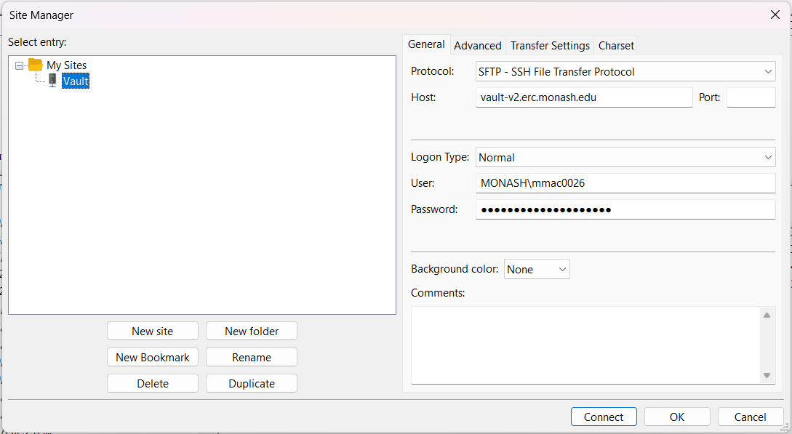
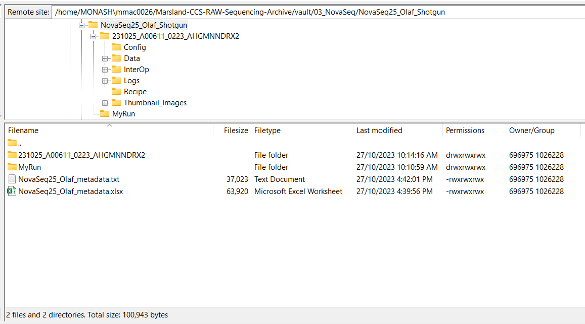

# Handling NovaSeq sequencing outputs

Here we discuss how to process the raw sequencing reads directly from the Illumina NovaSeq sequencer.

## What you should have "out of the box" 🗃️

Our runs are stored in Vault storage, and need to be transferred to the M3 MASSIVE cluster for processing. To inspect your files, the simplest way is to use FileZilla by setting up an SFTP connection as below. You need to ensure you have file access to the Vault prior to this.

{ align=center }

The basic file structure on the Vault should look something like below, with a main folder (long name) that contains the relevant files you need, and generally some sort of metadata file. You need to ensure that you have given all permissions to every file so that you can transfer them to the cluster &ndash; you can do this by right clicking the NovaSeq parent folder, selecting `File Attributes...`, and then adding all of the `Read`, `Write`, and `Execute` permissions, ensuring you select `Recurse into subdirectories`.

{ align=center }

## Transfer files to the cluster

### Sequencing data transfer 🚛

Navigate to an appropriate project folder on the cluster. An example command is shown below for transferring the data folder into a new folder called `raw_data` using `rsync`. If it doesn't exist, the folder you name will be created for you (just make sure you put a `/` after the new folder name).

```bash
rsync -aHWv --stats --progress MONASH\\mmac0026@vault-v2.erc.monash.edu:Marsland-CCS-RAW-Sequencing-Archive/vault/03_NovaSeq/NovaSeq25_Olaf_Shotgun/231025_A00611_0223_AHGMNNDRX2/ raw_data/
```

### BCL Convert sample sheet preparation 🗒️

Create a sample sheet document for BCL Convert (the tool that will demultiplex and prepare out FASTQ files from the raw data). The full documentation can be viewed [here](https://support.illumina.com/content/dam/illumina-support/documents/documentation/software_documentation/bcl_convert/bcl-convert-v3-7-5-software-guide-1000000163594-00.pdf).

The document should be in the following format, where `index` is the `i7 adapter sequence` and `index2` is the `i5 adapter sequence`. An additional first column called `Lane` can be provided to specify a particular lane number only for FASTQ file generation. We will call this file `samplesheet.txt`.

For the indexes, **both** sequences used on the sample sheet should be the reverse complement of the actual sequences.

If you make this on a Windows system, ensure you save your output encoded by `UTF-8` and not `UTF-8 with BOM`.

```bash
[Header]
FileFormatVersion,2

[BCLConvert_Settings]
CreateFastqForIndexReads,0

[BCLConvert_Data]
Sample_ID,i7_adapter,index,i5_adapter,index2
Abx1_d21,N701,TAAGGCGA,S502,ATAGAGAG
Abx2_d21,N702,CGTACTAG,S502,ATAGAGAG
Abx3_d21,N703,AGGCAGAA,S502,ATAGAGAG
Abx4_d21,N704,TCCTGAGC,S502,ATAGAGAG
Abx5_d21,N705,GGACTCCT,S502,ATAGAGAG
#etc.
```

## BCL Convert 🔄

### Install ⬇️

If you feel the need to have the latest version, visit the Illumina support website and copy the link for the latest CentOS version of the BCL Convert tool.

Otherwise use the version that is available on the M3 MASSIVE cluster, and skip to the run section.

```bash
# Download from the support website in the main folder
wget https://webdata.illumina.com/downloads/software/bcl-convert/bcl-convert-4.2.4-2.el7.x86_64.rpm

# Install using rpm2cpio (change file name as required)
module load rpm2cpio
rpm2cpio bcl-convert-4.2.4-2.el7.x86_64.rpm | cpio -idv
```

The most up-to-date bcl-convert will be inside the output `usr/bin/` folder, and can be called from that location.

### Run 🏃

With the `raw_data` folder and `samplesheet.txt` both in the same directory, we can now run BCL Convert to generate our demultiplexed FASTQ files. Ensure you have at least 64GB of RAM in your interactive smux session.

You will need a very high limit for open files &ndash; BCL Convert will attempt to set this limit to 65,535. However, by default, the limit on the M3 MASSIVE cluster is only 1,024 and cannot be increased by users themselves.

You can request additional open file limit from the M3 MASSIVE help desk.

!!! question "Can I run this on my local machine?"

    **Please note that the node `m3k010` has been decommissioned due to system upgrades.**

    However, it is more than possible to run this process quickly on a local machine if you have the raw BCL files available.
    The minimum requirements (as of BCL Convert v4.0) are:

    - **Hardware requirements**
      - Single multiprocessor or multicore computer
      - Minimum 64 GB RAM
    - **Software requirements**
      - Root access to your computer
      - File system access to adjust ulimit

You can start an interactive bash session and increase the open file limit as follows:

```bash
# Begin a new interactive bash session on the designated node
srun --pty --partition=genomics --qos=genomics --nodelist=m3k010 --mem=320GB --ntasks=1 --cpus-per-task=48 bash -i

# Increase the open file limit to 65,535
ulimit -n 65535
```

```bash
# Run bcl-convert
bcl-convert \
    --bcl-input-directory raw_data \
    --output-directory fastq_files \
    --sample-sheet samplesheet.txt
```

This will create a new output folder called `fastq_files` that contains your demultiplexed samples.

### Merge lanes ⛙

If you ran your samples without lane splitting, then you can merge the two lanes together using the following code, saved in the main project folder as `merge_lanes.sh`, and run using the command: `bash merge_lanes.sh`.

```bash title="merge_lanes.sh"
#!/bin/bash

# Merge lanes 1 and 2
cd fastq_files
for f in *.fastq.gz
  do
  Basename=${f%_L00*}
  ## merge R1
  ls ${Basename}_L00*_R1_001.fastq.gz | xargs cat > ${Basename}_R1.fastq.gz
  ## merge R2
  ls ${Basename}_L00*_R2_001.fastq.gz | xargs cat > ${Basename}_R2.fastq.gz
  done

# Remove individual files to make space
rm -rf *L00*
```