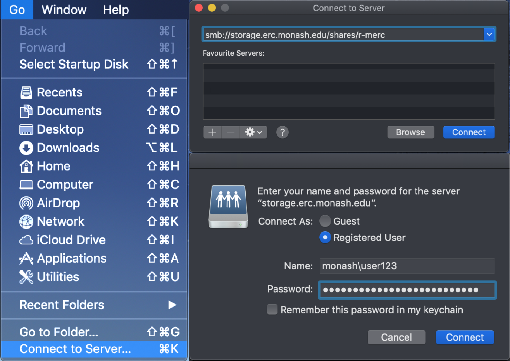
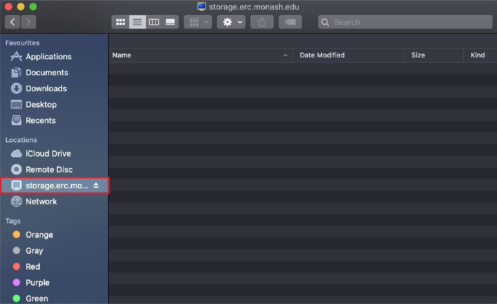

# Market Storage

## Overview

Market storage, also known as Market-file, is a disk-based storage solution designed for research data that requires regular access, typically on a daily basis. It functions similarly to Monash University's `S:\` Drive and is ideal for frequently changing data that is too large for local storage. Market storage can be accessed as a desktop share/network drive (SMB) or mounted on a server (NFS). Access is managed via user groups for SMB shares or network addresses for NFS shares.

### External access

Access to your Market storage when not using Monash Wi-Fi or WLAN connections requires your computer to be connected to the Monash VPN.
Instructions for set-up and connection are available [here](https://www.monash.edu/esolutions/network/vpn).

### Features and backup system

Exclusively using disk capacity, Market storage offers fast and immediate file access. Data remains in Market until it is either archived to Vault storage or deleted. Backups are conducted daily, with a 30-day retention period for recovery. 

!!! warning "Backup considerations"

    Changes made within a single day cannot be individually recovered, as only the latest version before the nightly backup is retained. Deleted files can be recovered within the 30-day window but are irretrievable beyond that.

### Recommendations for large collections

While Market storage supports large datasets, collections exceeding 10TB are best managed using a combination of Market and Vault storage. Active or analysed data should be stored in a smaller Market allocation, while older, unused data can be archived in Vault and retrieved as needed. Market storage can be shared externally through Aspera, a web-based tool for transferring large datasets, though it is unsuitable for critical or sensitive information. With less capacity than Vault storage, Market allocations are quota-based and can be requested via the Data Dashboard.

## Map the drive to your computer

=== "Linux"

    !!! warning "Monash VPN"

        Ensure that you have connected to the Monash VPN if you are off-site and not connected to the Monash network.

    The mount method for Linux requires a folder to be present somewhere on your machine &ndash; this needs to be created prior to mapping.
    This process requires root access to your machine, and will need to be run each time you reboot your machine.

    ```bash title="Create the mount folder"
    sudo mkdir /mnt/Market-Storage
    ```

    The command below mounts a remote storage location to a local directory on a Linux system using the `cifs` protocol (**C**ommon **I**nternet **F**ile **S**ystem). It provides access to a given share for the a particular user within Monash University's domain, using specific permissions and configuration settings.

    ```bash title="Mount the Market storage to a local folder"
    sudo mount -t cifs //storage.erc.monash.edu.au/shares/<name-of-share> /mnt/Market-Storage -o rw,dir_mode=0777,file_mode=0777,user=<short-monash-id>,domain=MONASH,vers=3
    ```

    ??? question "What are the different parts of the command line code?"

        1. `sudo`:
            - Executes the command with superuser privileges, necessary for mounting file systems.
        2. `mount -t cifs`:
            - `mount`: mounts a file system
            - `-t cifs`: specifies that a CIFS protocol filesystem is being used
        3. `//storage.erc.monash.edu.au/shares/<name-of-share>`:
            - The remote network location, specifying the server (`//storage.erc.monash.edu`) and the specific share being accessed.
        4. `/mnt/Market-Storage`:
            - The local directory where the remote share will be mounted. Files and directories within the remote share will appear under this directory.
        5. `-o`:
            - Indicates additional options to be passed to the mount command.
        6. Options in the `-o` flag:
            - `rw`: mounts the share with both read and write access.
            - `dir_mode=0777`: sets the permissions for directories to full access (read, write, execute) for all users.
            - `file_mode=0777`: sets the permissions for files to full access (read, write, execute) for all users.
            - `user=<short-monash-id>`: specifies the username to authenticate with the network share. This is your short Monash ID code, not the longer version.
            - `domain=MONASH`: indicates the domain for authentication, which is `MONASH` here.
            - `vers=3`: specifies the version of the SMB (Server Message Block) protocol to use. Version 3 is more secure and efficient than prior versions.

    !!! note "Password"

        When you run the `mount` command, you will be prompted to enter your Monash password. This is your Monash login password, and not necessarily the same as your computer login, depending on which machine you are using.

=== "MacOS"

    !!! warning "Monash VPN"

        Ensure that you have connected to the Monash VPN if you are off-site and not connected to the Monash network.

    1. With your Finder window open, click the `Go` menu at the top-left of the screen. 
    2. Navigate to the `Connect to Server...` menu, and a new pop-up window will appear.
    3. Enter the appropriate remote network location into the top, and press `Connect`.
        - This should look something like this: `smb://storage.erc.monash.edu.au/shares/<name-of-share>`
        - Double check whether the network location provided to you has a `monash.edu.au` or `monash.edu` suffix.
    4. Enter your Monash ID and password details when prompted, and click on `Connect`

    !!! warning "Monash vs. personal computer"

        Note that if you are not using a Monash supplied and configured computer, you will need to add `MONASH\` to your username.

    

    The newly-mapped share will then appear as a folder in the MacOS Finder.

    

=== "Windows"

    !!! warning "Monash VPN"

        Ensure that you have connected to the Monash VPN if you are off-site and not connected to the Monash network.
    
    The command below mounts a remote storage location to a local directory on a Windows system using the PowerShell command line interface on Windows. It provides access to a given share for the a particular user within Monash University's domain.

    ```bash title="Mount the Market storage to a local folder"
    net use M: \\storage.erc.monash.edu.au\shares\<name-of-share> /USER:MONASH\<short-monash-id>
    ```

    ??? question "What are the different parts of the command line code?"

        1. `net use`:
            - A built-in Windows command to manage network connections. It is used to map or disconnect a network drive or check the status of existing connections.
        2. `M:`:
            - Specifies the local drive letter to assign to the network share. In this example, the share will be accessible through the `M:` drive on the user's computer, but can be changed to anything you would like.
        3. `\\storage.erc.monash.edu.au\shares\<name-of-share>`:
            - The remote network location, specifying the server (`storage.erc.monash.edu`) and the specific share being accessed.
        4. `/USER:MONASH\<short-monash-id>`:
            - Specifies the credentials to authenticate with the network share. This is your short Monash ID code, not the longer version.
        
        You can also add `/PERSISTENT:YES` to the end as an option to make the mapping persistent across reboots.
    
    !!! info "Clearing cached credentials"

        Sometimes you need to clear the cached credentials, perhaps because you entered them incorrectly.
        To do this, delete the credentials that Windows has "helpfully" saved.

        ```bash title="Clear cached credentials"
        net use \\storage.erc.monash.edu\shares\<name-of-share> /delete
        ```

        You can then re-enter the correct (or updated) credentials.