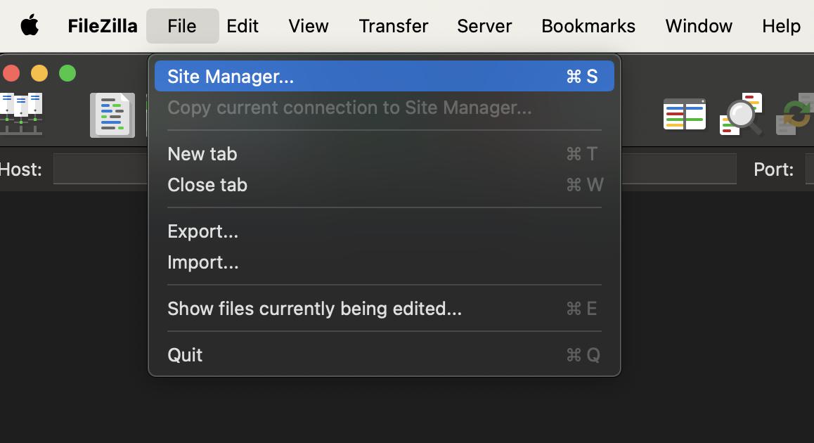
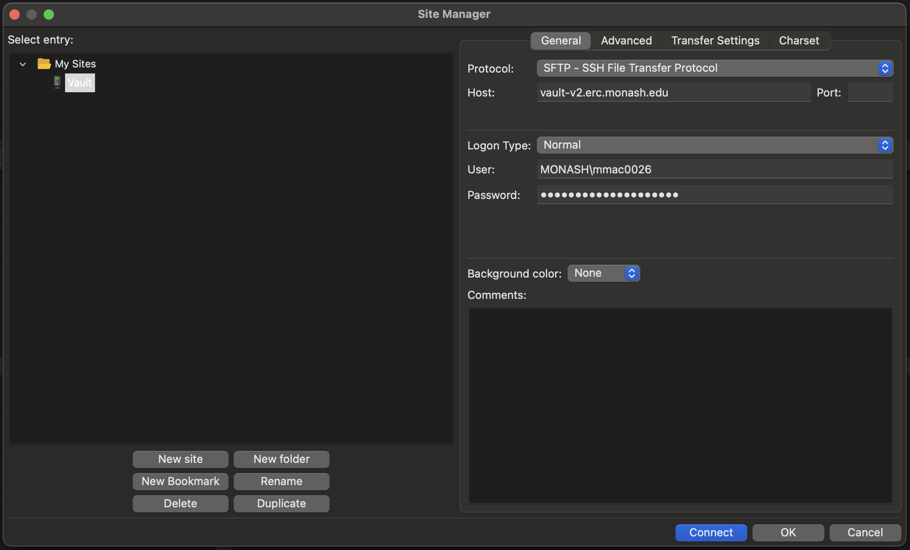
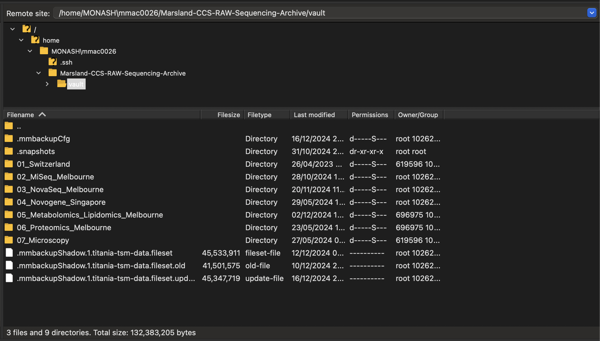

# Vault Storage

## Overview

{ width=20%, align=right }

Vault storage is a tape-based solution ideal for long-term data retention and redundancy. It is suited for infrequently accessed data and can serve as a backup for locally stored files. Vault is accessible via desktop shares/network drives (SMB), server mounts (NFS), or protocols like SFTP and rsync. Access is managed via user groups for SMB or by network address for NFS. See the [Vault Storage User Guide](https://docs.erc.monash.edu/RDSM/UserGuides/VaultStorageUserGuide) for more information.


### Tape storage 📼

Vault combines disk and tape storage for efficiency. The disk acts as a fast cache for recently written data, while the tape stores older, less accessed files. By default, files not accessed for seven days are migrated to tape, though policies can be adjusted. Taped files remain visible in directories and are automatically recalled when accessed, taking five or more minutes depending on file size and quantity.

!!! info "Requesting storage"

    There is a significant amount of Vault capacity available and allocations are assigned individual quotas. Vault storage can be requested via the Data Dashboard.

!!! warning "Recall of tape files"

    Tape recalls can be slow, particularly for many small, scattered files, due to the process of locating tapes, loading them, and accessing specific data. Users are encouraged to organize data into structured folders and bundle small files into archives (e.g., using ZIP, TAR, or SquashFS) to enable quicker retrieval. For urgent access to large datasets, bulk recalls can be requested but are uncommon and assessed on a case-by-case basis.

## Accessing the Vault 🏦

=== "Filezilla 🦖"

    !!! warning "Monash VPN"

        Ensure that you have connected to the Monash VPN if you are off-site and not connected to the Monash network.
    
    The easiest way to access your Vault storage is via [Filezilla](https://filezilla-project.org/).
    Once you have downloaded and installed the software, you can set up a new site.

    - Click the `Site Manager` icon at the top-left of the screen.

    

    - Using the `SFTP` protocol, connect to `vault-v2.erc.monash.edu` using `Normal` logon type and your Monash credentials.

    !!! note "Vault access 🔐"

        Users need to make sure they have requested and been granted Vault access first &ndash; Monash credentials alone are not sufficient.

    

    - Click `Connect`. You will then see the Vault file explorer show up in the right-hand side of the screen.

    

    - You can then navigate to the files you need to download and add them to your FileZilla transfer queue. The process works the same for upload.

=== "Rsync 🔄"

    !!! warning "Monash VPN"

        Ensure that you have connected to the Monash VPN if you are off-site and not connected to the Monash network.

    You can also transfer files and folders using `rsync` &ndash; this is commonly preinstalled on Unix-like operating systems.

    - You can check for a install by running `rsync --help`. If you get the help menu showing up, you're good to go.
    
    ??? question "I don't have it installed... where do I get Rsync from?"

        === "MacOS 🍎"

            - Ensure you have [Homebrew](https://brew.sh/) installed (this requires root access to install).
            - Install using the following Homebrew command:

            ```bash title="Install rsync"
            # Install using Homebrew
            brew install rsync
            ```

        === "Linux 🐧"

            - It would be quite strange if `rsync` is not pre-installed, but you can easily install it on Debian-based platforms (like Ubuntu) using the following command (this requires root access):
            
            ```bash title="Install rsync"
            # For Debian-based Linux distributions
            sudo apt-get install rsync
            ```
    
    **Transferring data** 🚛

    Navigate to an appropriate project folder on the cluster. An example command is shown below for transferring the data folder into a new folder called `raw_data` using `rsync`. If it doesn't exist, the folder you name will be created for you (just make sure you put a `/` after the new folder name).

    ```bash
    rsync -aHWv --stats --progress MONASH\\mmac0026@vault-v2.erc.monash.edu:Marsland-CCS-RAW-Sequencing-Archive/vault/03_NovaSeq/NovaSeq25_Olaf_Shotgun/231025_A00611_0223_AHGMNNDRX2/ raw_data/
    ```

    You can upload files back to the Vault by reversing the ordering of the directories so that the local folder comes first.