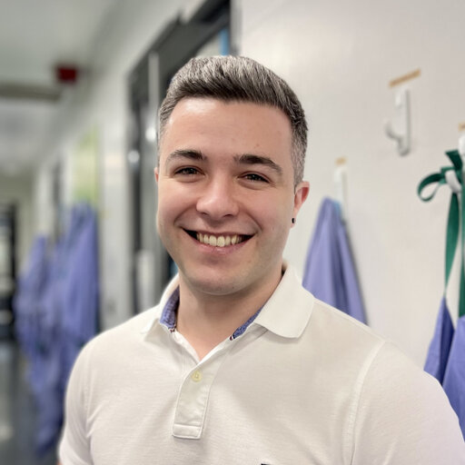
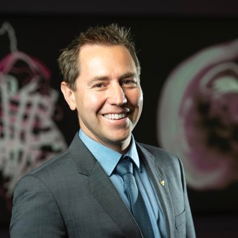

# Welcome to the Mucosal Immunology Lab Bioinformatics Hub

## Overview

Over the years, we have refined several workflows for processing of the various omic modalities we utilise within our group.
As with any workflows in the bioinformatics field, these are constantly evolving as new tools and best practices emerge.
As such, this *hub* is very much a work-in-progress, and will remain so as we continue to add to and update it.

### Contributors

These sort of tasks are never accomplished alone! Massive thanks to the people who have contributed this.

-   { width="150" }  
    **Matthew Macowan**

-   { width="150" }  
    **Céline Pattaroni**

-   { width="150" }  
    **Giulia Iacono**

* Alana Butler
* Bailey Cardwell

## Group Research Overview

[The Mucosal Immunology Research Group](https://www.monash.edu/medicine/translational/immunology/research/mucosal-immunology-research-group), led by Professors Marsland, Harris and Westall, is focused on understanding the fundamental principles in health and disease of the gut, lung and nervous system. Projects span the space from discovery using preclinical models of host-microbe interactions and inflammation through to high performance computational approaches to identify clinical biomarkers and development of novel drug candidates.

### Group Heads

-   { width="150" }  
    [**Ben Marsland**](https://research.monash.edu/en/persons/benjamin-marsland)

-   { width="150" }  
    [**Nicola Harris**](https://research.monash.edu/en/persons/nicola-harris)

-   { width="150" }  
    [**Glen Westall**](https://research.monash.edu/en/persons/glen-westall)

