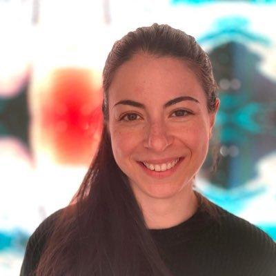

# Welcome to the Mucosal Immunology Lab Bioinformatics Hub

## Overview

Over the years, we have refined several workflows for processing of the various omic modalities we utilise within our group.
As with any workflows in the bioinformatics field, these are constantly evolving as new tools and best practices emerge.
As such, this *hub* is very much a work-in-progress, and will remain so as we continue to add and update it.

### Contributors

These sort of tasks are never accomplished alone! Massive thanks to the people who have contributed this.

-   { width="150" }  
    **Matthew Macowan**

-   { width="150" }  
    **Céline Pattaroni**

-   { width="150" }  
    **Giulia Iacono**

* Alana Butler
* Bailey Cardwell